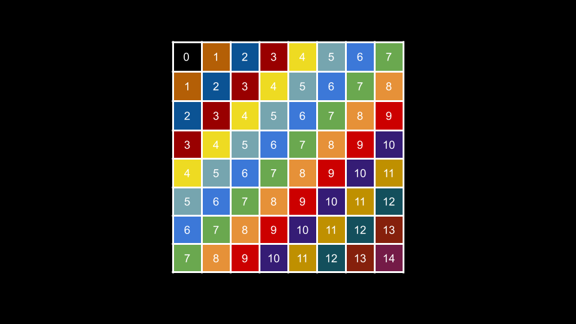
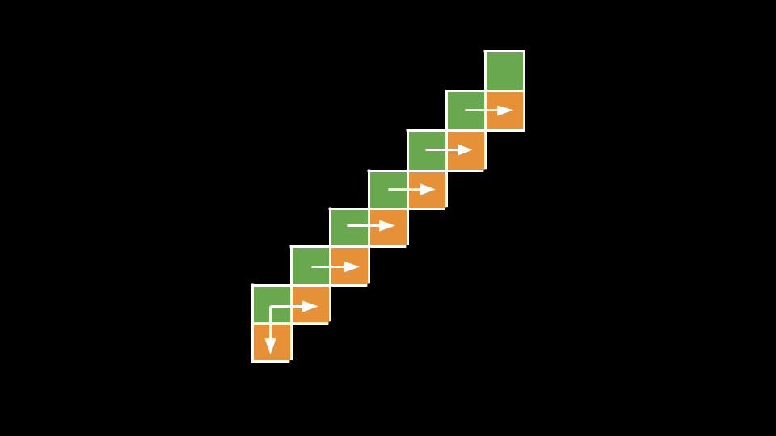
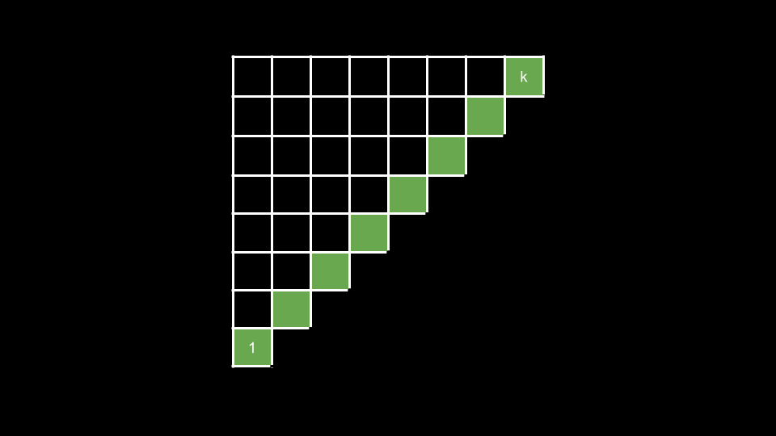

### Approach 1: Group Elements by the Sum of Row and Column Indices

#### Intuition

The crux of the problem is figuring out how to identify the diagonals and how to iterate over them. We will make use of an important property of diagonals in this approach.

Let's say you are currently at the start of a diagonal (bottom-left) and your coordinates are `row, col`. How do you get to the next value in the diagonal? You go up and right. By going up, you move to `row - 1`. By going right, you move to `col + 1`. That is, our row decreases by `1`, and our col increases by `1`.

This is true for any given point in any given diagonal. If we were to consider the sum `row, col`, it would be constant along the diagonal since the `-1` from moving up cancels out the `+1` from moving right!

As you can see in the above image, every square is annotated with `row + col`. Each diagonal shares the same values.

For each square, we will use the sum `row + col` as an identifier to the diagonal that it belongs to. We will use a hash map groups where `groups[x]` is a list of all values that appear in the diagonal with identifier `x`.

To collect the cells on each diagonal in the correct order, we will iterate through each row from left to right starting with the bottom row. The reason we choose the bottom-up, left-to-right order is that the diagonals move upward and to the right, so by iterating to the upper right, we will visit the squares in the correct order.

Once we have populated `groups`, we simply need to iterate over the identifiers and add each list to our answer. Notice that conveniently, the order in which we visit the diagonals is the same as the identifier order! What we mean by this is that the first diagonal we traverse is `0`, then `1`, then `2`, and so on.

Thus, we can use an integer `curr` initialized to `0` that represents the current diagonal we are adding to our answer. We add `groups[curr]` to the answer, then increment `curr`, and repeat until `curr` is no longer in `groups`.

#### Algorithm

1. Initialize a hash map `groups`.

2. Iterate `row` from `nums.length - 1` to `0`:

    - Iterate `col` from `0` until `nums[row].length`:

        - Calculate `diagonal = row + col`.

        - Add `nums[row][col]` to `groups[diagonal]`.

3. Initialize the answer list `ans` and `curr = 0`.

4. While `curr` is in `groups`:

    - Add all the elements of `groups[curr]` to `ans` in order.

    - Increment `curr`.

5. Return `ans`.

#### Complexity Analysis

Given `n` as the number of integers in `nums`,

-   Time complexity: $O(n)$

    -   We iterate over each of the `n` integers to populate `groups`, then we iterate over them again to populate `ans`.

-   Space complexity: $O(n)$

    -   The values of `groups` are lists that together will store exactly `n` integers, thus using $O(n)$ space.

### Approach 2: Breadth First Search

#### Intuition

In the previous approach, we require two passes. The first pass populates `groups`, and the second pass populates `ans`. Can we do better, perhaps solving the problem in one pass?

Yes! Let's think about the grid as a graph. Each square is a node, and we can imagine each node having an edge to the squares below and to the right (if they exist). Let's take a look at the diagonal image again:

As you can see, a node with identifier `x` has edges to nodes with identifier `x + 1`. If we consider the top-left square `0, 0` as a "source" node, then each square's identifier is exactly equal to its distance from the source. This allows us to visit the diagonals in order using BFS!

> If you are not familiar with BFS, please check out the relevant [LeetCode Explore Card](https://leetcode.com/explore/learn/card/queue-stack/231/practical-application-queue/).

We start a BFS from `0, 0`. At each node `row, col`, we first push `row + 1, col` to the queue and then `row, col + 1`. Note that we only add a square to the queue if it both exists and has not been visited yet.

How do we know if a square has been visited yet? We could use a hash set to keep track of visited squares, but there is a simpler way. We only need to consider the square `row + 1, col` (down) if we are at the start of a diagonal. Otherwise, for every other square on the diagonal, the square below it has already been visited by the right edge of the previous square.

The level-wise nature of BFS will ensure that we visit all squares in a diagonal with identifier `x` before we visit any square in a diagonal with identifier `x + 1`. This means we will visit the diagonals in the correct order. Because we add the square `row + 1, col` before `row, col + 1`, we will also traverse over each diagonal in the correct order as well. This means our entire BFS will traverse the input in the same order as the answer, allowing us to solve the problem in one pass!

#### Algorithm

1. Initialize a `queue` with `(0, 0)` and the answer list `ans`.

2. While `queue` is not empty:

    - Remove `(row, col)` from `queue`.

    - Add `nums[row][col]` to `ans`.

    - If `col == 0` and `row + 1` is in bounds, add `(row + 1, col)` to `queue`.

    - If `col + 1` is in bounds for the current row, add `(row, col + 1)` to queue.

3. Return `ans`.

#### Complexity Analysis

Given `n` as the number of integers in grid,

-   Time complexity: $O(n)$

    -   During the BFS, we visit each square once, performing $O(1)$ work at each iteration.

-   Space complexity: $O(\sqrt{n})$

    -   The extra space we use is for `queue`. The largest size `queue` will be is proportional to the size of the largest diagonal.

    -   Let's say you had a diagonal with a size of `k` starting from the bottom left of the input and going to the top right. What are the fewest squares possible that could support such a diagonal existing? The first square in the diagonal can be the only square in its row. The second square in the diagonal needs one square to its left. The third square in the diagonal needs two squares to its left, and so on.

As you can see in the above image, the green diagonal requires many squares to its left to support its existence. In fact, we can notice that if we extended the image to a square, we would have a grid of size $k * k$. That means to support a diagonal of size `k`, we require $\dfrac{k^2}{2} = O(k^2)$ squares.

The conclusion is that a grid of size $O(k^2)$ can only support a diagonal of size $k$. In our problem, we defined the input grid to have a size of $n$. Thus, the largest diagonal it could support would be $O(\sqrt{n})$.
