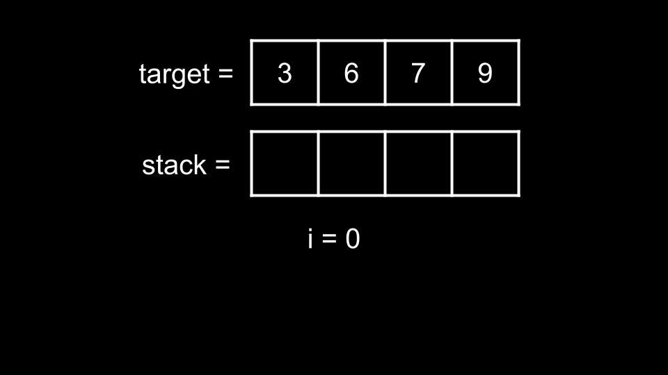
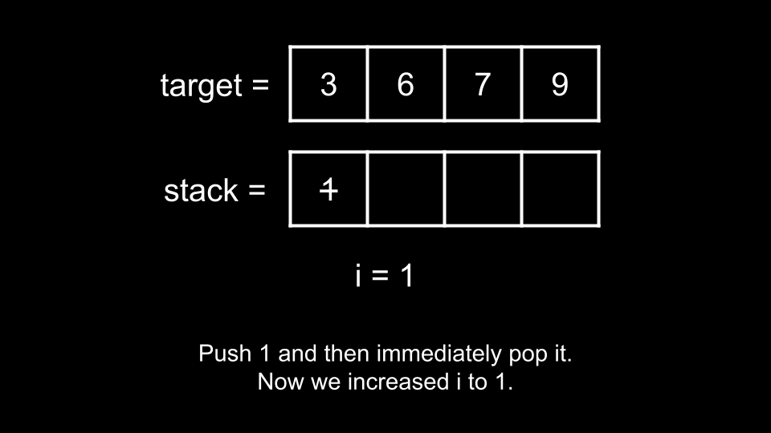
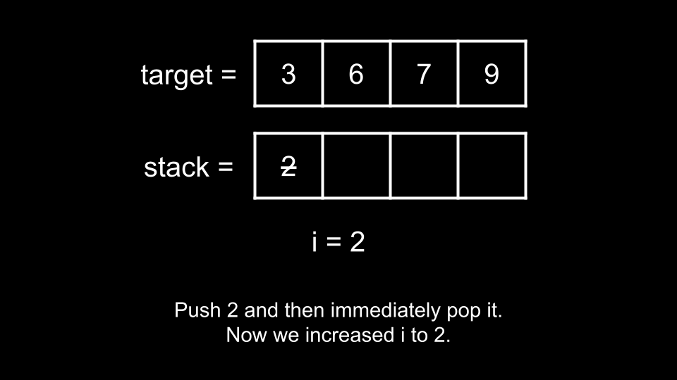
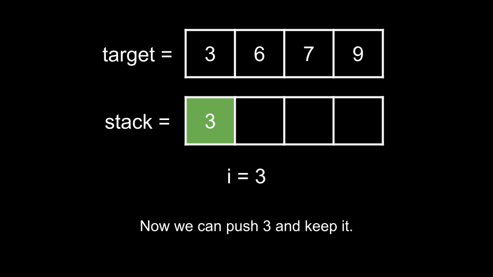
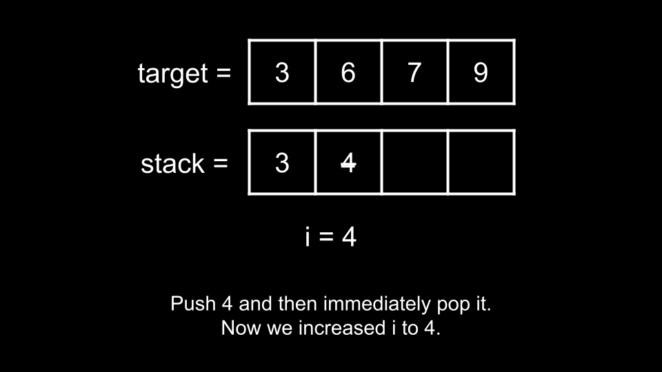
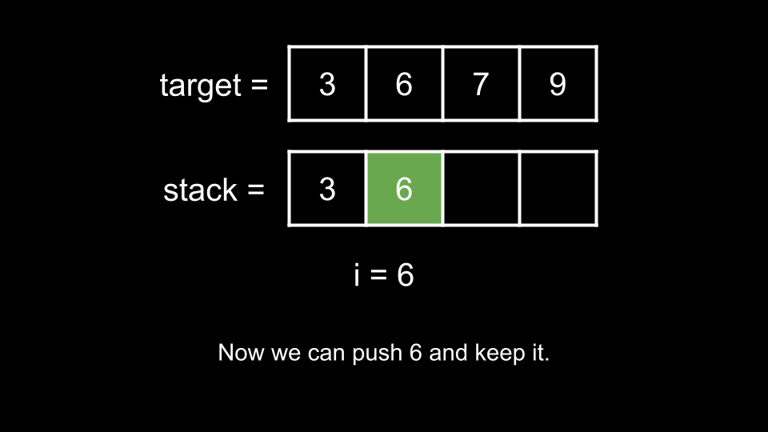

### Approach: Simulate

#### Intuition

In this problem, we are given two stack operations:

- Push a number to the stack

- Pop off the top of the stack

The numbers that we push to the stack are ordered from 1 to n. Each number is available only once, so if we pop a number from the stack, that number is permanently gone. This means we want to pop every number that does not appear in target and should never pop any number that does appear in target.

We stop once the stack is equal to target and we are allowed to return any valid answer. Because target is always sorted and the stream of numbers always comes in ascending order, we can build target one element at a time, starting with the first element.

Let's use an integer `i` that represents the most recently pushed number. Initially, `i = 0` as no numbers have been pushed yet.

In this example, the first number we need to reach in target is `3`. Before we can reach `3`, we need to go through `1, 2`. However, we don't want either `1` or `2` in the answer, so we can immediately pop `1` after pushing it, and pop `2` after pushing it. Essentially, we are only pushing them to move forward until we reach `3`.

Now, we are ready to push `3`, so we do so.

To get to the next number `6`, we must first go through `4, 5`. Again, we don't want either `4` or `5` in the answer, so we can immediately pop `4` after pushing it, and pop `5` after pushing it.

Now, we are ready to push `6`, so we do so.

We continue this process for each number in `target`. This brings us to our solution. We iterate over each `num` in `target`:

- We push and immediately pop the current number, then increment `i`, and repeat the process until we are ready to push `num`.

- When are we ready to push `num`? Recall that `i` represents the most recently pushed number. Thus, we are ready to push `num` when the most recently pushed number is `i = num - 1`.

- Once we are ready, we simply push and increment i.

#### Algorithm

1. Initialize the answer `ans` and the integer `i` = 0.

2. For each `num` in `target`:

- While `i < num - 1`:

  - Add `"Push"` to `ans`.

  - Add "Pop" to `ans`.

  - Increment `i`.

- Add `"Push"` to `ans`.

- Increment `i`.

3. Return `ans`.

#### Complexity Analysis

- Time complexity: O(n)

  Let `k` denote the largest (final) element in `target`. We push (and maybe pop) every number from `1` until `k`. This gives us a maximum of 2k operations. In the worst case scenario, `k = n`, which gives us a time complexity of O(n).

- Space complexity: O(1)

  We don't count the answer as part of the space complexity. Thus, we aren't using any extra space other than the integer `i`.
