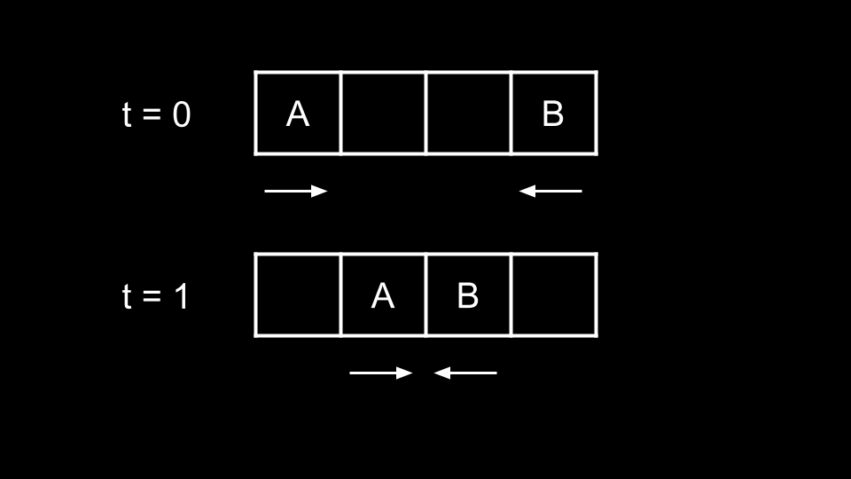
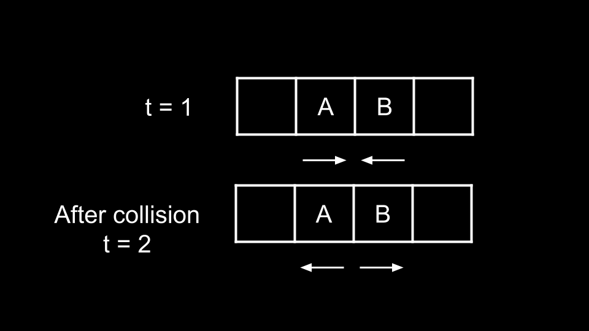
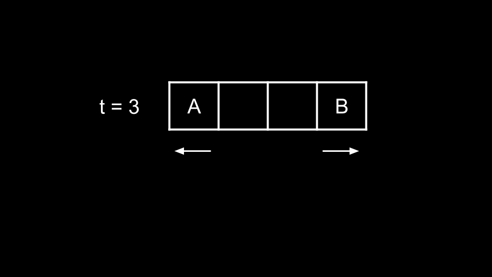
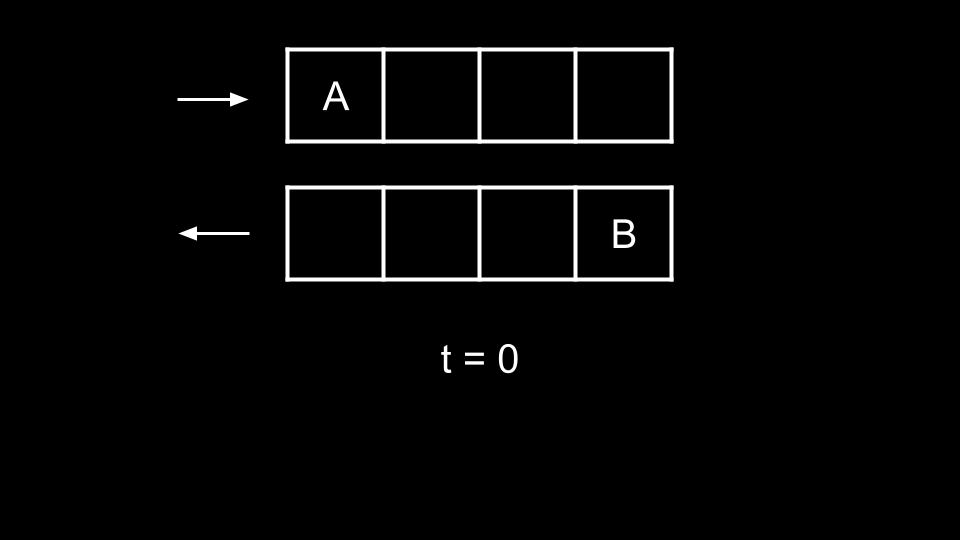
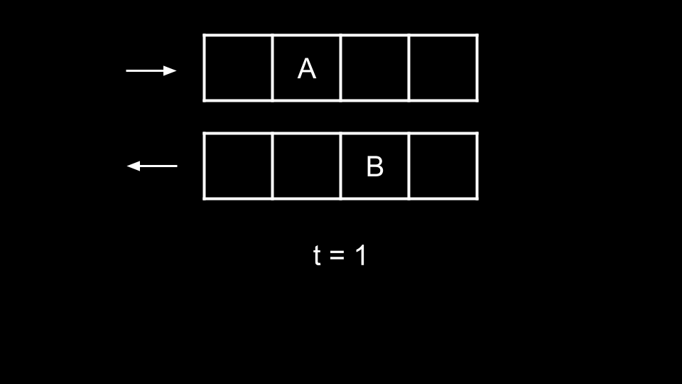
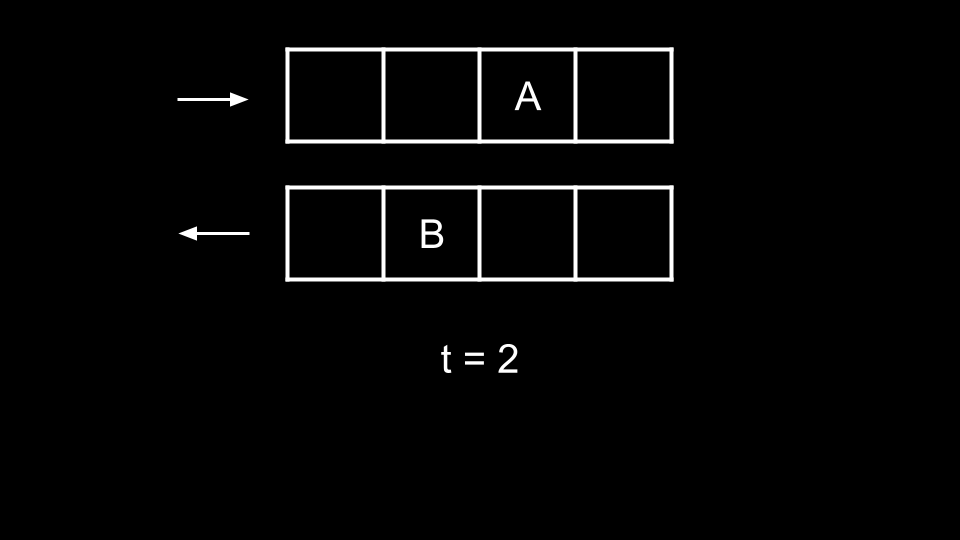
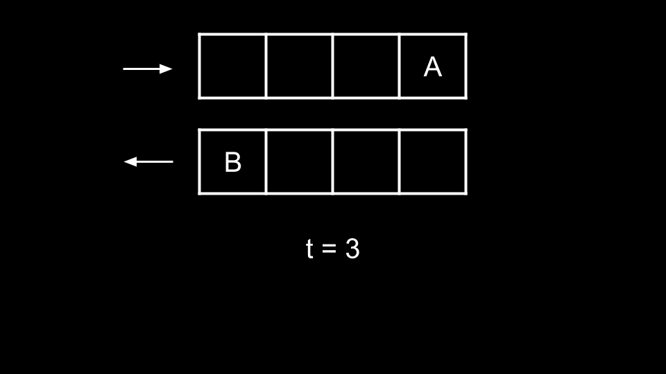

### Approach: Ants Pass Each Other!

#### Intuition

Initially, this problem may seem daunting as there could be many possible collisions between the ants.

However, we can make a few observations that simplify the problem greatly. The first thing to notice is that collisions happen instantaneously. The second thing to notice is that all ants walk at the same speed. The final thing to notice is that the ants eventually fall off the plank, so there won't be any infinite collisions.

This brings us to the critical observation. Let's say we have an ant `A` walking right and an ant `B` walking left, and they are on a collision course.

At `t = 1`, the ants are about to collide. At `t = 2`, the ants try to walk forward and collide, thus swapping directions.

At `t = 3`, they reach the end of the plank and fall off.

Now, let's consider a new scenario with the same ants `A` and `B`. Imagine if all the ants walking left were on one plank, and all the ants walking right were on a different plank.

At `t = 2` in the original scenario, the ants collide and swap directions. In the new scenario, the ants will simply pass each other.

The two scenarios are actually equivalent! That is, the collisions are completely irrelevant. Why?

When the ants collide, they do not change position because their attempt at moving forward is blocked. What we mean here is that at `t = 2`, `A` is at index `1` and tries to walk to the right. However, it collides into `B` and stays at index `1`. The same can be said for `B` remaining at position `2`.

However, the ant that they collided with is at the position that they would have been at had there not been any collision. The ant they collided with also now has their original velocity (since their velocities swapped after the collision).

Because all the ants here are the same, we previously referred to them as `A` and `B` for better distinction. They have no differences in reality. Thus two ants colliding according to the rules and simply passing through each other are two entirely identical scenarios. If the ant they collided with has their original velocity and is at the same position they would have been at had there not been any collision (and vice-versa), did the collision really change anything? No.

Thus, we can consider the ants walking right simply passing through those walking left. So what will be our `ans`wer?

- An ant walking left from position num will take `num` time to fall off the plank.

- An ant walking right from position num will take `n - num` time to fall off the plank.

We simply take the maximum of all these times.

#### Algorithm

1. Initialize `ans` = 0.

2. Iterate over `left`. For each `num`:

   - Update `ans` with `num` if it is larger.

3. Iterate over right. For each `num`:

   - Update `ans` with `n - num` if it is larger.

4. Return `ans`.

#### Complexity Analysis

Given `n` as the length of `left` and `m` as the length of `right`,

- Time complexity: O(n + m)

  We iterate over `left` and `right` once, performing O(1) work at each iteration.

- Space complexity: O(1)

  We aren't using any extra space except the for loop iteration variable.
