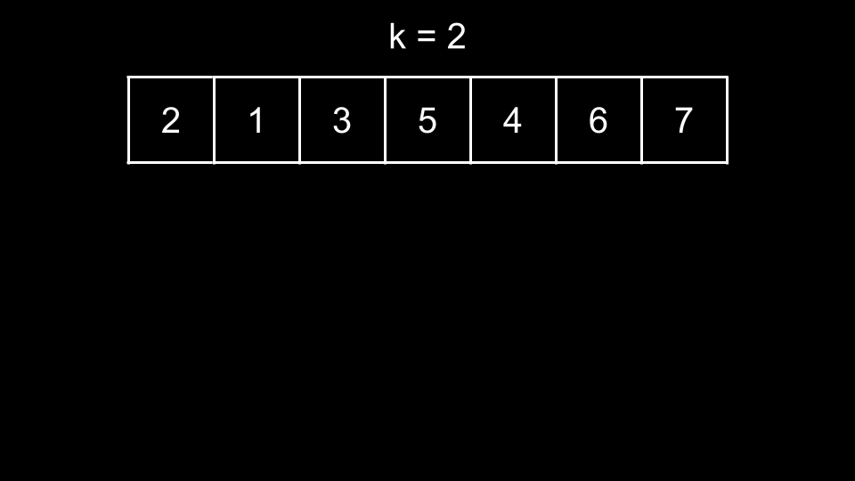
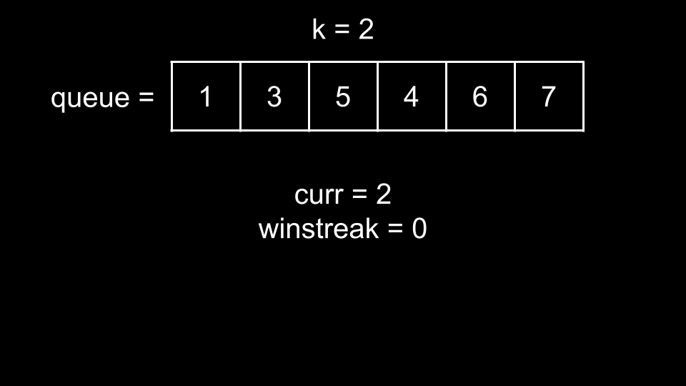
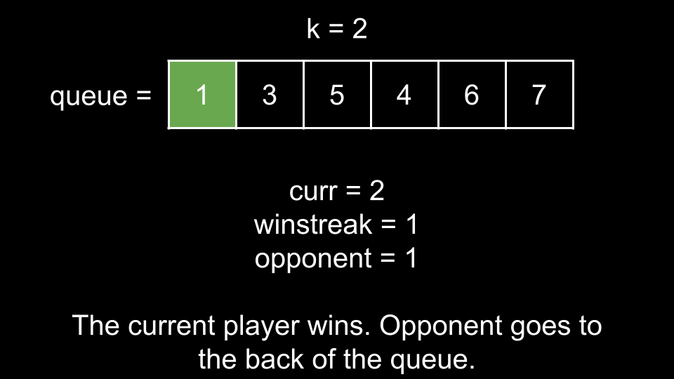
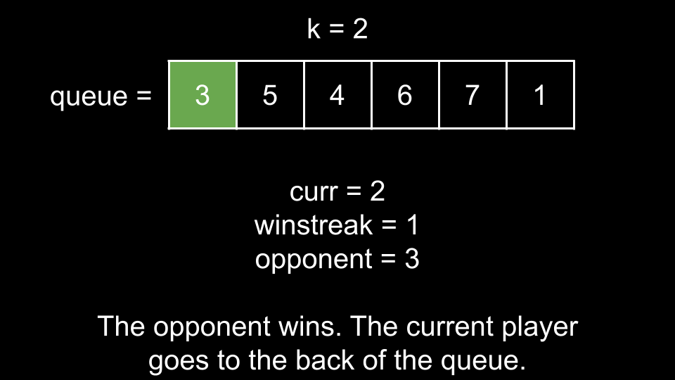
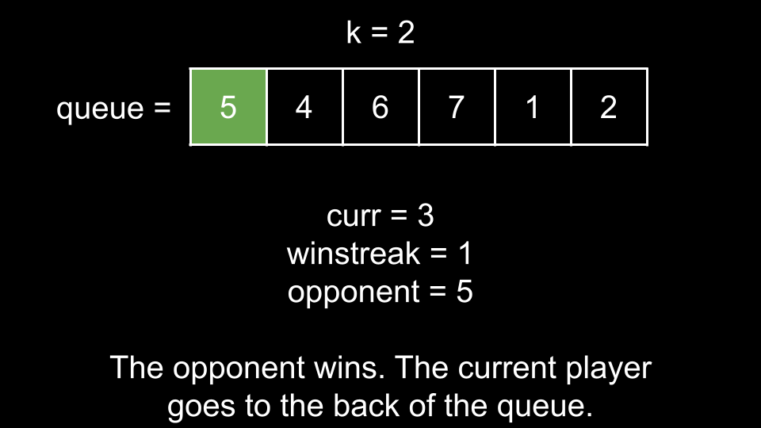
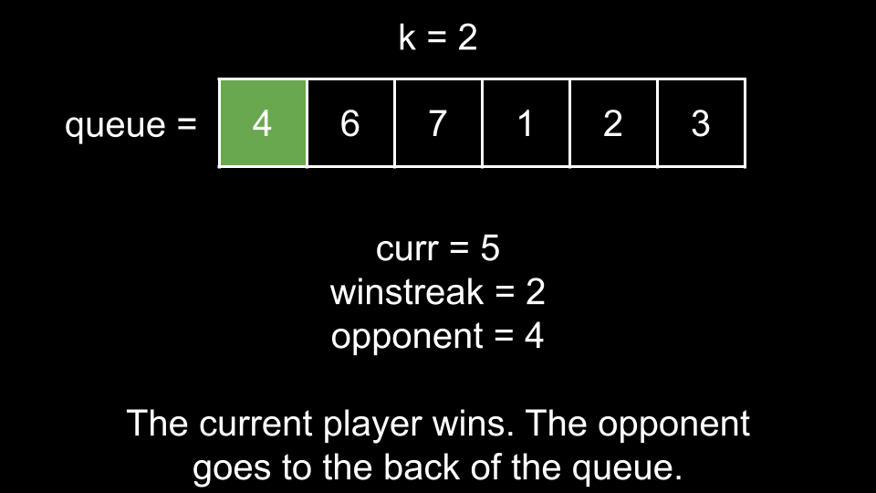
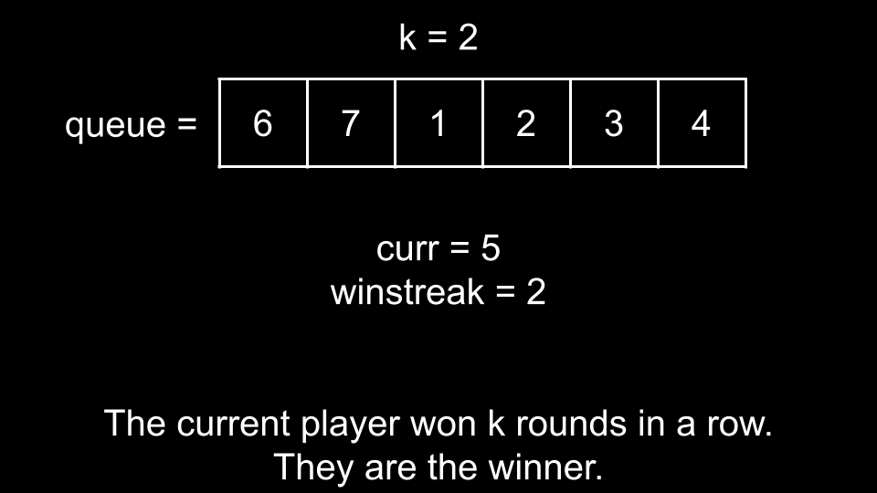

### Observação

Apesar da solução oficial abaixo, para resolver o problema não é necessário uma fila. Se ao final da primeira passagem o número de vitórias não é suficiente, fatalmente a solução será o maior valor do array.

### Approach 1: Simulate Process With Queue

#### Intuition

We have an interesting game here. Let's try to fully understand it so that we can simulate it.

- In each round, two players face each other. The player with a larger value wins.
- The problem states that `arr` has distinct integers, so we don't need to worry about tiebreaks.
- The game ends when someone wins `k` rounds in a row.
- The game starts between the first two elements of `arr`. The other elements of `arr` represent a line.
- After each round, the next round is played between the winner and the next player in line.
- The loser goes to the end of the line.

The functionality of a line can be implemented using a queue. We remove from the front of the queue to determine the next player, and we add to the back of the queue when a player loses. Using a queue and some integers, we can simulate the game.

- Let `curr` represent the winner of the most recent round. Initially, `curr = arr[0]`.
- Let `winstreak` represent the winstreak of the current player. Initially, `winstreak = 0`.
- Let `queue` represent the line. Initially, `queue` holds all the elements of arr in order, except for the first element.

Now, let's simulate the game. At each round:

- Remove from the front of `queue` and let this value be `opponent`.
- If `curr > opponent`, the current player wins. Add opponent to the back of `queue` and increment `winstreak`.
- Otherwise, `opponent` wins. Add curr to the back of `queue`, update `curr = opponent`, and set `winstreak = 1`.
- If `winstreak = k`, the current player has won `k` rounds in a row. We can return `curr`.

This simulation process works, but there is an issue. If we examine the constraints, we find that `k` can be up to 1 billion! If we tried to simulate a billion rounds, we would exceed the time limit. How do we solve this?

We can make another observation: let the player with the largest value in `arr` be `maxElement`. Since the elements in the array are all unique, this player will never lose a round, so if the current player ever becomes `maxElement`, it will surely end up winning so many games as long as the simulation continues, no matter how large the required `k` is. Thus, if `curr = maxElement`, we can immediately return `curr` without actually simulating all the games, because we know that all future games will result in `curr` winning!

#### Algorithm

1. Initialize:

- `maxElement` as the maximum element in `arr`.
- `queue` as a queue with every element in `arr` except the first one.
- `curr = arr[0]`.
- `winstreak = 0`.

2. While `queue` is not empty (could also do while True):

- Pop `opponent` from the front of `queue`.
- If `curr > opponent`:
  - Push `opponent` to the back of `queue`.
  - Increment `winstreak`.
- Else:
  - Push `curr` to the back of `queue`.
  - Set `curr = opponent`.
  - Set `winstreak = 1`.
- If `winstreak = k` or `curr = maxElement`, return `curr`.

3. The code should never reach this point since there is guaranteed to be a winner. Return anything.
   Implementation

Complexity Analysis

Given `n` as the length of `arr`,

- Time complexity: O(n)

  We spend O(n) to find `maxElement` and to initialize `queue`.

  Then, we perform a while loop. Each iteration of the while loop costs O(1). The number of iterations is limited to O(n), since we visit the elements of `arr` in order and terminate if we find `maxElement`. Thus, the while loop costs up to O(n).

  Note that the value of k is not relevant. If `k < n`, then it wouldn't change the time complexity. If `k > n`, we would terminate before `k` operations anyway, as we must find `maxElement` within `n` rounds.

- Space complexity: O(n)

  `queue` has a size of O(n).
