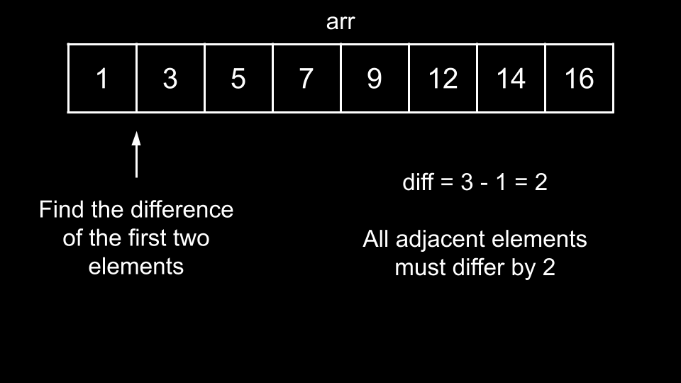
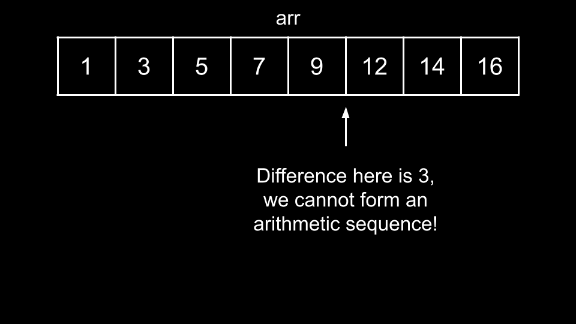
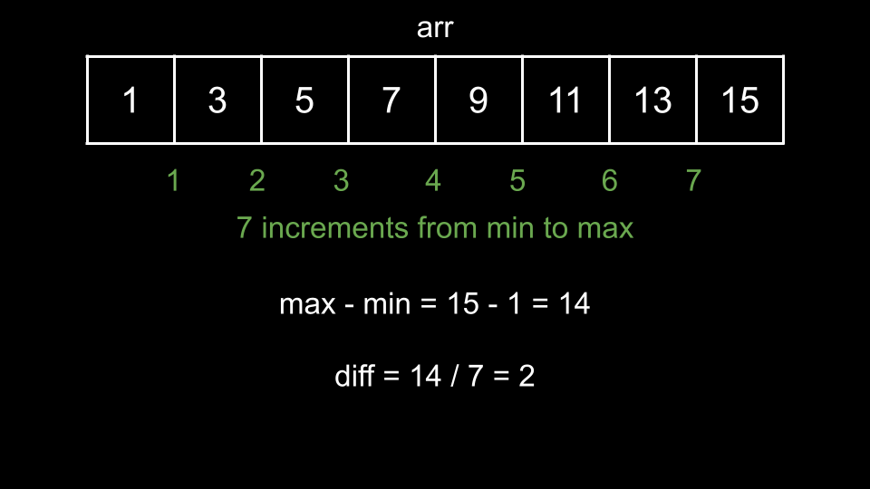

### Approach 1: Sort and Check

#### Intuition

The first thing to notice is that any arithmetic sequence must be sorted. This is because each successive element differs by a constant amount, so the entire sequence must be monotone since the change is constant.

For a given subarray `arr`, how do we check if we can form an arithmetic sequence? The problem states that we are allowed to rearrange `arr`. Thus, we should start by sorting `arr`, since if we can form an arithmetic sequence, the sequence must be sorted.

Once we have sorted `arr`, we can simply iterate over each adjacent element and check if the differences are constant. We will initialize `diff = arr[1] - arr[0]` as the difference between the first two elements.

We will then iterate over all other adjacent elements and check if their difference is equal to diff. If any difference is not equal to diff, then we cannot form an arithmetic sequence.

If all differences are equal to `diff`, then we can form an arithmetic sequence. This brings us to our solution. We will define a function `check(arr)` that takes a subarray `arr` and applies the above process to determine if it is an arithmetic sequence.

Then, we will iterate over all pairs `l[i], r[i]` and form `arr` as the subarray of `nums` from `l[i]` `r[i]`. Once we have `arr`, we will pass it into check to find the answer for the i^th query.

#### Algorithm

1. Define `check(arr)`:

    - Sort `arr`.
    - Initialize `diff = arr[1] - arr[0]`.
    - Iterate `i` over the indices of `arr`, starting from `2`:
        - If `arr[i] - arr[i - 1] != diff`, return `false`.
    - Return `true`.

2. Initialize the answer `ans`.

3. Iterate `i` over the indices of `l`:

    - Create `arr` as the subarray of `nums` from indices `l[i]` to `r[i]`.
    - Add `check(arr)` to `ans`.

4. Return `ans`.

#### Complexity Analysis

Given `n` as the length of `nums` and `m` as the length of `l` and `r`,

-   Time complexity: $O(m \cdot n \cdot \log{}n)$

    -   There are `m` queries. In the worst-case scenario, each query would have `r[i] - l[i] = O(n)`, representing an array of size $O(n)$.

    -   Then, we would require $O(n)$ to create `arr`, $O(n \cdot \log{}n)$ to sort arr, and $O(n)$ to iterate over `arr`.

    -   Thus, in the worst-case scenario, each of the `m` queries costs $O(n \cdot \log{}m)$.

-   Space complexity: $O(n)$

    -   We create `arr`, which may use up to $O(n)$ space.

### Approach 2: No Sorting

#### Intuition

We can implement check more efficiently! While it is true that any arithmetic sequence is sorted, we don't need to exploit this fact to determine if `arr` is an arithmetic sequence.

Let's say `arr` has a length of `n`, and we have the maximum element in `arr` as `max` and the minimum element as `min`.

If `arr` were to form an arithmetic sequence, then the difference `diff` that defines the sequence must be equal to `(max - min) / (n - 1)`.

Why? Because `min` must be the first element of the sequence and `max` must be the final element of the sequence. Thus, if we started at `min` and iterated to `max`, we would require `n - 1` iterations. On each iteration, our value would increase by `diff` (by definition).

Therefore, we increment by a total of `diff * (n - 1)`. By starting at `min` and ending at `max`, we cover a total distance of `max - min`. Thus, we have `diff * (n − 1) = max − min`, which we can rearrange as `diff = (max - min) / ( n - 1)`.

If `diff` is not an integer, then we cannot have an arithmetic sequence. If it is, how do we verify if `arr` is an arithmetic sequence or not?

If `arr` is an arithmetic sequence, then `min + diff` must be in `arr`. Similarly, `min + 2 * diff` must be in `arr`. In fact, every value of `min + k * diff` that is less than `max` must be in `arr`. We can check if all of these numbers are in `arr`, and if they are, then `arr` must be an arithmetic sequence. For efficient O(1) checks, we will convert `arr` to a hash set.

We can then check if all necessary numbers exist with a while loop. We initialize `curr = min + diff` as the first number to check. If `curr` is not in `arr`, we can immediately return `false`. Otherwise, we check the next number by incrementing `curr` by `diff`. We repeat this process until `curr = max`. If all the numbers are in the hash set, then we return `true`.

#### Algorithm

1. Define `check(arr)`:

    - Iterate over `arr` to do the following:
        - Find `minElement`, the minimum element in `arr`,
        - Find `maxElement`, the maximum element in `arr`.
        - Create `arrSet`, a hash set with all the elements of `arr`.
    - Calculate `diff = (maxElement - minElement) / (arr.length - 1)`. If it is not an integer, return `false`.
    - Initialize `curr = minElement + diff`.
    - While `curr < maxElement`:
        - If `curr` is not in `arrSet`, return `false`.
        - Increment `curr` by `diff`.

2. Initialize the answer `ans`.

3. Iterate `i` over the indices of `l`:

    - Create `arr` as the subarray of `nums` from indices `l[i]` to `r[i]`.
    - Add `check(arr)` to `ans`.

4. Return `ans`.

#### Complexity Analysis

Given `n` as the length of nums and `m` as the length of `l` and `r`,

-   Time complexity: $O(m \cdot n)$

    -   There are `m` queries. In the worst-case scenario, each query would have `r[i] - l[i] = O(n)`, representing an array of size $O(n)$.

    -   Then, we would require $O(n)$ to create `arr`, $O(n)$ to create `arrSet`, and $O(n)$ to verify if `arr` is an arithmetic sequence.

    -   Thus, in the worst-case scenario, each of the `m` queries costs $O(n)$.

-   Space complexity: $O(n)$

    -   We create `arr` and `arrSet`, which may use up to $O(n)$ space.
