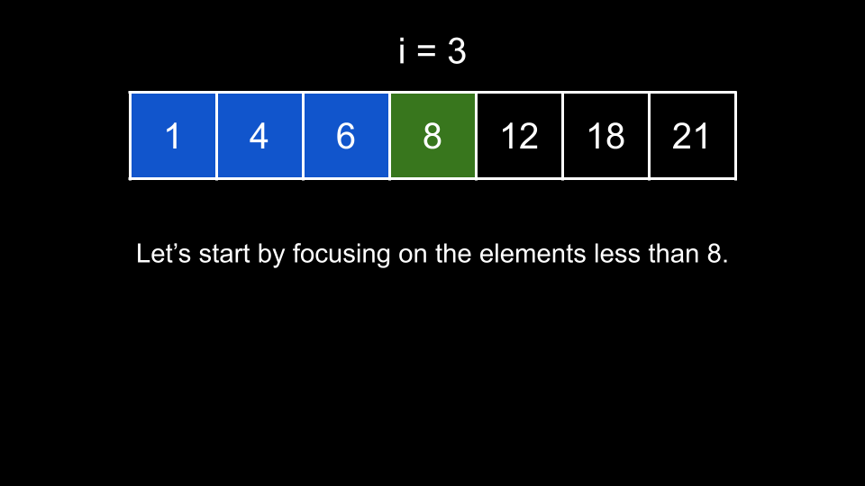
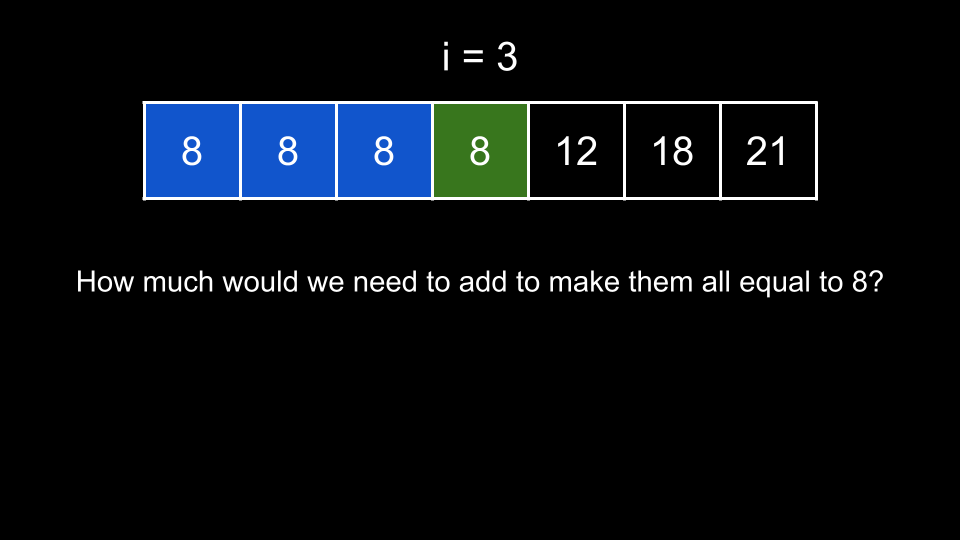
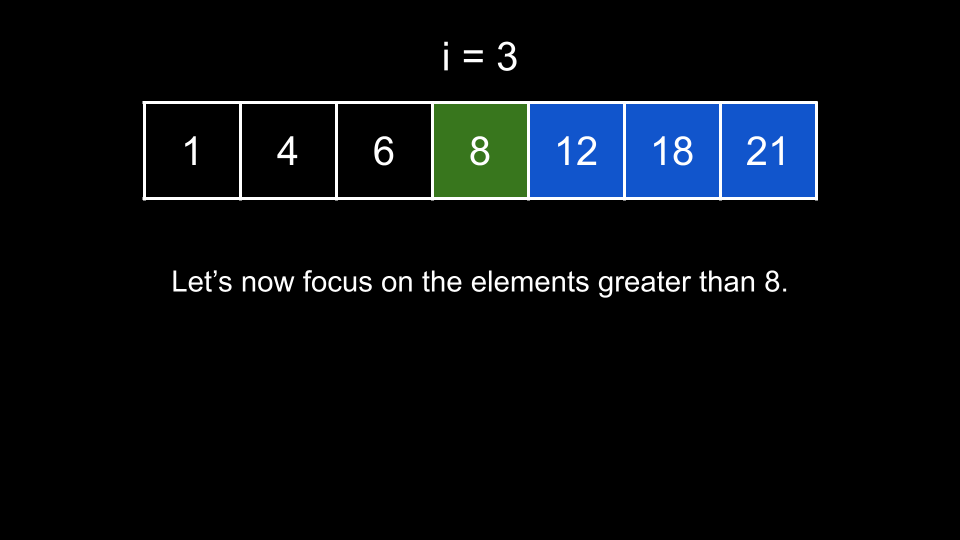
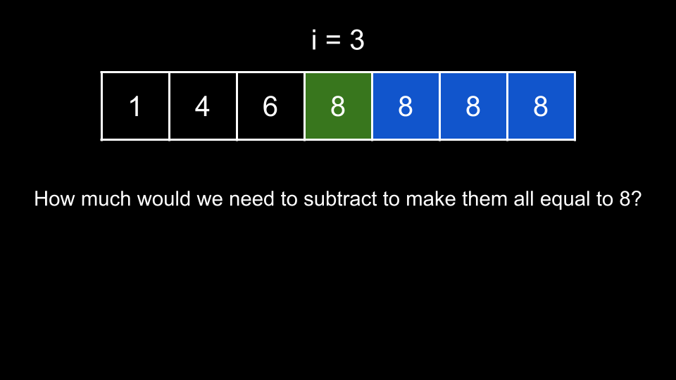

### Approach 1: Prefix Sum

#### Intuition

Because the input is given sorted, let's try to split the problem into two parts. For a given `num` at index `i`, the answer for this index is the sum of:

-   The sum of absolute differences between `num` and all numbers less than `num`.

-   The sum of absolute differences between `num` and all numbers greater than `num`.

As `nums` is sorted, we can focus on all indices less than `i` for the first part and all indices greater than `i` for the second part. Let's start with the first part with the following example.

The sum of differences is equivalent to the sum we would have to add to the numbers to make them all equal to 8.

If we made all the numbers equal to 8, they would have a sum equal to 8 times the count of numbers `leftCount`. In this specific example, they would have a sum of `3 * 8 = 24`. In general, for an index `i`, there are `i` elements less than `nums[i]`, so we have `leftCount = i` and these numbers would have a sum of `leftCount * nums[i]`.

Their current sum is `leftSum = 1 + 4 + 6 = 11`. Thus, we can find the sum of absolute differences for these elements as `leftTotal = 24 - 11 = 13`. In general, we have `leftTotal = leftCount * nums[i] - leftSum`. This makes sense as it is the difference between what the elements would be if they were all equal to `nums[i]` minus what they currently are, which is precisely what the problem is asking for.

What about the elements on the right?

We can make use of the same idea - how much would we need to subtract from the numbers on the right to make them all equal to 8? Note we subtract here instead of adding because the numbers on the right are greater.

How many elements are on the right? In this example, there are 3, so they would have a sum of `8 * 3 = 24`. In general, for an index `i`, there are `rightCount = n - 1 - i` elements on its right, and they would have a sum of `rightCount * nums[i]` if we reduced them all.

In our example, they currently have a sum of `rightSum = 12 + 18 + 21 = 51`. Thus, the sum of absolute differences is `51 - 24 = 27`. In general, we can find the sum of absolute differences as `rightTotal = rightSum - rightCount * nums[i]`.

Now, we know how to find the answer for each index `i`. But how do we find `leftSum` and `rightSum`? We can make use of prefix sums to find the sum of any subarray in O(1).

We start by building a prefix sum array `prefix`, where `prefix[i]` represents the sum of all elements up to and including index `i`. Then, we can calculate `leftSum = prefix[i] - nums[i]` and `rightSum = prefix[n - 1] - prefix[i]`. Note that this is simply how we are implementing the prefix sum in this article, and you may implement it in whatever way you are most comfortable. The important thing is that we can quickly calculate `leftSum` and `rightSum`.

Once we have prefix, we iterate over each index `i` and use the process we described above to find `leftTotal` and `rightTotal`. Then, the answer for index `i` is simply `leftTotal + rightTotal`.

#### Algorithm

Let `n` be the length of `nums`.

1.  Create a prefix sum of `nums`.

2.  Initialize the answer list `ans`.

3.  Iterate i over the indices of `nums`:

    -   Calculate `leftSum` using `prefix`.

    -   Calculate `rightSum` using `prefix`.

    -   Calculate `leftCount = i`.

    -   Calculate `rightCount = n - 1 - i`.

    -   Calculate `leftTotal = leftCount * nums[i] - leftSum`.

    -   Calculate `rightTotal = rightSum - rightCount * nums[i]`.

    -   Add `leftTotal + rightTotal` to `ans`.

4.  Return `ans`.

#### Complexity Analysis

Given `n` as the length of `nums`,

-   Time complexity: $O(n)$

    -   Creating `prefix` requires $O(n)$ time. Then, we iterate over `nums`, performing $O(1)$ work at each iteration. Thus, we require $O(n)$ time.

-   Space complexity: $O(n)$

    -   `prefix` has a length of `n`.

### Approach 2: Calculating Prefix Sum on the Fly

#### Intuition

In fact, we do not need the prefix array. As `leftSum` for any adjacent indices like `i` and `i + 1` only differ by one element, we can calculate `leftSum` on the fly by initializing it to `0` and simply adding each number we iterate over to it. If we know `leftSum`, then we can also deduce what `rightSum` is by taking the `totalSum` of the array and subtracting `leftSum` and `nums[i]` from it. This avoids the need to build a prefix sum array and achieves the same result.

Thus, we will start by finding the `totalSum`, and then use that to calculate `rightSum` while calculating `leftSum` on the fly. Everything else remains the same.

#### Algorithm

Let `n` be the length of `nums`.

1. Initialize `totalSum` as the sum of `nums`, `leftSum = 0`, and the answer list `ans`.

2. Iterate `i` over the indices of `nums`:

    - Calculate `rightSum = totalSum - leftSum - nums[i]`.

    - Calculate `leftCount = i`.

    - Calculate `rightCount = n - 1 - i`.

    - Calculate `leftTotal = leftCount * nums[i] - leftSum`.

    - Calculate `rightTotal = rightSum - rightCount * nums[i]`.

    - Add `leftTotal + rightTotal` to `ans`.

    - Add `nums[i]` to `leftSum`.

3. Return `ans`.

#### Complexity Analysis

Given `n` as the length of `nums`,

-   Time complexity: $O(n)$

    -   Creating `totalSum` requires $O(n)$ time. Then, we iterate over `nums`, performing $O(1)$ work at each iteration. Thus, we require $O(n)$ time.

-   Space complexity: $O(1)$

    -   We don't count the answer toward the space complexity. Thus, we are only using a few integer variables.
