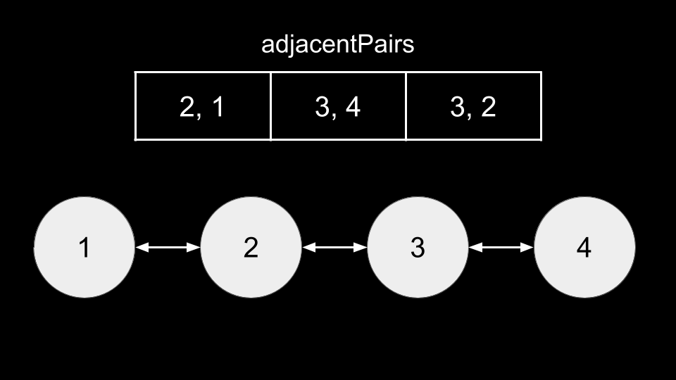

### Approach 1: Depth-First Search (DFS)

#### Intuition

In this problem, we are given information about numbers that are adjacent to each other in some array `nums`. We can think of these pairs in `adjacentPairs` as edges in a graph: if we have a pair `(x, y)`, we can imagine that there is an undirected edge between node x and y.

This graph would form a doubly-linked list, since the edges, by definition, only describe adjacent elements. In fact, this doubly-linked list would represent `nums`, since the adjacent elements are adjacent elements in `nums`!

This simplifies our problem: to recover `nums`, we simply need to perform a traversal over the graph, starting from one end of the "linked list". This is because as stated above, the graph/linked list represents `nums`. Thus, if we start at either end, we will continuously visit adjacent numbers one by one until we reach the other end, which is equivalent to iterating over the elements of `nums` in order.

This brings us to the question: how do we find either end of the graph/linked list, so that we know where to start the traversal from? From the above image, there are two ends: 1 and 4. You may notice that these nodes only have one edge, whereas other nodes have exactly two edges. This is because every node has a node to its left and to its right, except for the nodes at the ends.

Thus, we can identify a root as a node that only has one edge. Once we have a root, we will perform a DFS from it.

It is typical in a DFS over a graph to use a data structure (usually a hash map) seen that keeps track of nodes we have already visited. In this problem, since the graph essentially forms a doubly linked list, we don't need to use any data structure. We simply need to keep track of the previous node we visited `prev`. Each node can have at most two edges: the node we came from, and a node we haven't visited yet. By keeping track of `prev` and not traversing to it, we ensure that we walk in a straight line and never visit a node twice.

At each node during the traversal, we add node to an answer list `ans`. Once the traversal is finished, `ans` will be a valid `nums`.

Algorithm

1. Initialize a `graph`, where `graph[node]` holds a list of neighbors for `node`.

2. Iterate over each edge `(x, y)` in `adjacentPairs`:

    - Add `y` to `graph[x]`.
    - Add `x` to `graph[y]`.

3. Iterate over each `num` in `graph`:

    - If the length of `graph[num]` is equal to `1`, set `root = num` and break from the loop.

4. Define a function dfs(node, prev, ans):

    - Add `node` to `ans`.
    - Iterate over each `neighbor` in `graph[node]`:
    - If `neighbor != prev`:
        - Call `dfs(neighbor, node, ans)`.

5. Initialize the answer list `ans`.

6. Call `dfs(root, k, ans)`, where `k` can be any value that is guaranteed to not appear in the graph, such as `infinity`.

7. Return `ans`.

#### Complexity Analysis

Given `n` as the length of the hypothetical `nums`,

-   Time complexity: $O(n)$

    -   Note that the length of `adjacentPairs` is equal to $n - 1$.

    -   We first build `graph`, which involves iterating over $O(n)$ edges. Next, we find `root`, which may cost $O(n)$ iterations. Finally, we perform a DFS.

    -   In the DFS, we never visit a node more than once. At each node, we perform $O(1)$ work. Thus, the DFS costs $O(n)$.

-   Space complexity: $O(n)$

    -   When performing the DFS, the recursive call stack uses $O(n)$ space. Also, `graph` will have a size of $O(n)$.

### Approach 2: Iterative, Follow the Path

#### Intuition

As we discussed in the previous approach, the graph of this problem is essentially a linked list, so we don't need any algorithm like DFS or BFS (Breadth-First Search) to traverse it. We can just iteratively traverse it like we would a linked list.

Here, we implement `graph` and find `root` in the same manner as the previous approach.

Next, instead of a DFS, we use a variable `curr` that represents the current node. We also use a variable `prev` to indicate the previously visited node, to ensure we only move in a straight line. Note that the length of `graph` will be equal to the length of `nums` since each number in `nums` has at least one edge, and thus an entry in graph.

With this in mind, we will have a while loop that runs until `ans.length = graph.length`, indicating we have finished building `ans`. In this while loop, we iterate over each `neighbor` of `graph[curr]`. If `neighbor != prev`, it is the next node we should go to. We add `neighbor` to `ans`, update `prev` and `curr` accordingly, then break from the iteration to move on to the next node.

Once the while loop ends, we know that `ans` is complete, so we can simply return `ans`.

#### Algorithm

1. Initialize a `graph`, where `graph[node]` holds a list of `neighbors` for `node`.

2. Iterate over each edge `(x, y)` in `adjacentPairs`:

    - Add `y` to `graph[x]`.
    - Add `x` to `graph[y]`.

3. Iterate over each `num` in `graph`:

    - If the length of `graph[num]` is equal to `1`, set `root = num` and break from the loop.

4. Initialize the following variables:

    - `curr` = `root` as the current node.
    - `ans = [root]` as the answer list.
    - `prev` as the previous node we saw. Initialize it to any value that can't be in the graph, like infinity.

5. While the length of `ans` is less than the length of `graph`:

    - Iterate over each `neighbor` of `graph[curr]`:
        - If `neighbor != prev`:
            - Add `neighbor` to `ans`.
            - Update `prev = curr`.
            - Update `curr = neighbor`.
            - Break from the iteration.

6. Return ans.

#### Complexity Analysis

Given `n` as the length of the hypothetical nums,

-   Time complexity: $O(n)$

    -   Note that the length of `adjacentPairs` is equal to $n - 1$.

    -   We first build `graph`, which involves iterating over $O(n)$ edges. Next, we find `root`, which may cost $O(n)$ iterations.

    -   Finally, we iterate over each node in order. At each node, we perform $O(1)$ work. Thus, this iteration costs $O(n)$ for $O(n)$ nodes.

-   Space complexity: $O(n)$

    -   `graph` uses $O(n)$ space.
