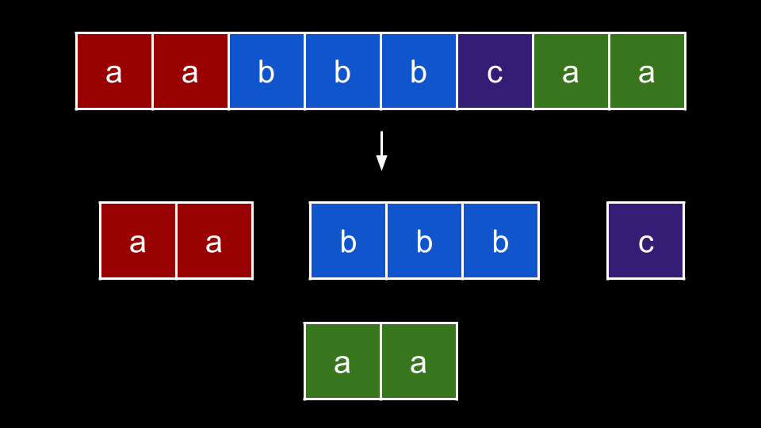
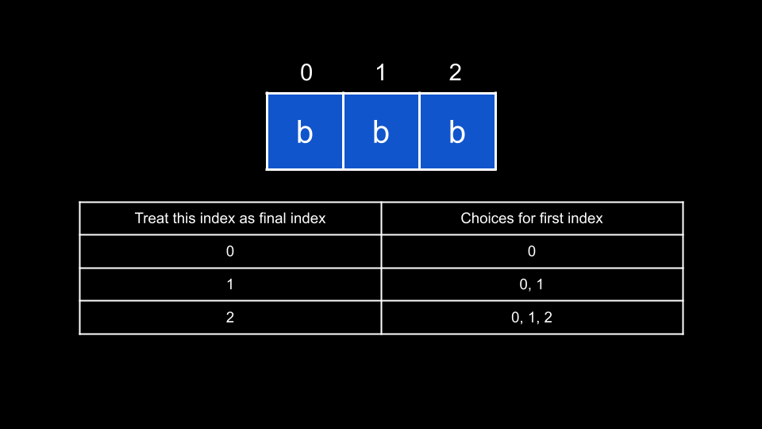

### Approach: Counting Streaks

#### Intuition

To solve this problem, we will make use of a very common counting trick that shows up in many LeetCode problems. The trick rests on the simple fact:

-   In a string of length `n`, there are `n` substrings that **end** with the final character.

What do we mean by this? Let's say you had the string `"abcd"`. How many substrings end with `d`?

1. If we choose `a` as the first character, we have the substring `"abcd"`.
2. If we choose `b` as the first character, we have the substring `"bcd"`.
3. If we choose `c` as the first character, we have the substring `"cd"`.
4. If we choose `d` as the first character, we have the substring `"d"`.

In general, we lock in the final character, and then have `n` choices for the first character. Thus, the answer is always the length of the string.

In this problem, we need to find the number of substrings where every character is equal. We can start by separating each group of similar characters in the string:

We can consider each group individually and sum up their answers to find the overall answer. Let's take a look at the blue group, `"bbb"`:

This group has a length of `3`. If we want to form a substring from this group, we need to decide on two things: the starting index and the ending index.

For the ending index, we have 3 choices. For each ending index `i`, as we established above, we have `i + 1` choices for the starting index. From the example, you can see that by choosing index `2` as the ending index, we can choose index `0`, `1`, or `2` as the starting index.

This brings us to our solution. We will iterate over the string `s` and keep track of the current streak of consecutive characters we have seen. Let's say we use a variable `currStreak` to track this.

For an index `i`, if `s[i] == s[i - 1]`, then we increment `currStreak`. Otherwise, we reset `currStreak = 1` as we have lost our streak and must start a new one with `s[i]`.

Now, at each index, we consider: how many homogenous substrings can end at this index? `currStreak` tells us the length of our current group, and since we are treating the current index as the ending index, the answer to this question is `currStreak`.

Thus, we simply add `currStreak` to our answer at each iteration. Going back to our example with `"bbb"`, when we encounter the first `"b"`, we have `currStreak = 1` and add `1` to our answer. This is because the only homogenous substring that could end at this character is the substring which is the character itself.

At the next `"b"`, we increase `currStreak` to `2`. Then, we add `2` to our answer. We have two choices for starting indices: the first `"b"` and the current `"b"`.

Lastly, we go to the final `"b"` and increase `currStreak` to `3`. Now, we add `3` to our answer as we have three choices for starting indices: the first, second, and current `"b"`.

#### Algorithm

Note: to avoid overflow, all arithmetic should be done MOD 10^9^ + 7.

1. Initialize:

    - The answer `ans = 0`.
    - The current streak `currStreak = 0`.
    - The modulus `MOD = 10^9 + 7`.

2. Iterate `i` over the indices of `s`:

    - If `i == 0` or `s[i] == s[i - 1]`, increment `currStreak`.
    - Otherwise, reset `currStreak = 1`.

3. Add `currStreak` to `ans`.

4. Return `ans`.

#### Complexity Analysis

Given `n` as the length of `s`,

-   Time complexity: $O(n)$

    -   We iterate over each index of s once, performing $O(1)$ work at each iteration.

-   Space complexity: $O(1)$

    -   We aren't using any extra space except for a few integer variables.
