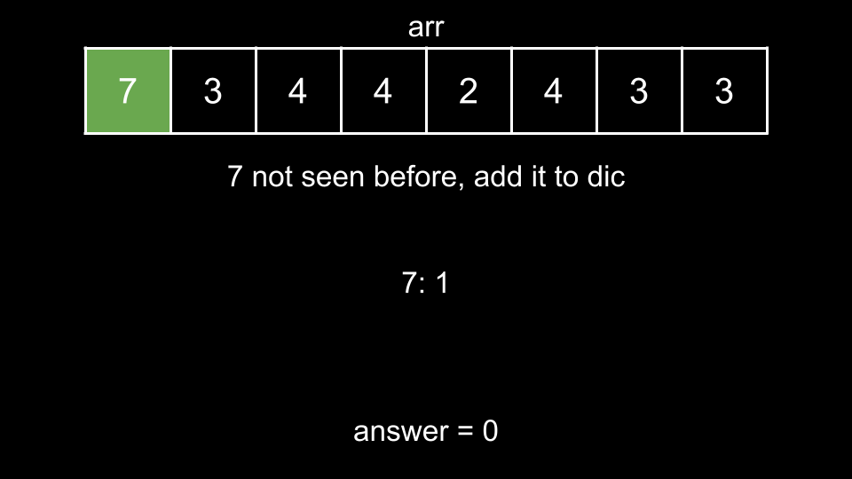

### Approach: Counting With Hash Map

#### Intuition

In this problem, we are presented with the following formula:

`nums[i] + rev(nums[j]) == nums[j] + rev(nums[i])`

Let's denote `x = nums[i]` and `y = nums[j]` and rewrite the formula:

`x + rev(y) == y + rev(x)`

Now, let's rearrange the formula so that all terms involving `x` are on one side and all terms involving `y` are on the other:

`x - rev(x) == y - rev(y)`

We have simplified the problem. As you can see, for a given `num`, we are interested in `num - rev(num)`. Let's define a new array `arr` with the same length as `nums` where:

`arr[i] = nums[i] - rev(nums[i])`

To reverse the digits of a given integer `num` as described by the problem, we can initialize an integer `result = 0` as the reversed number. We then continuously take the last digit of `num` using the modulo operator `%` and append it to result as the least significant digit, this could be done by multiplying result by `10` and adding the last digit. Then we remove the last digit from `num` by dividing it by `10`.

The process above continues until `num` becomes `0`, at which point, `result` contains the reversed integer.

Now, the problem becomes "how many pairs in arr `are` equal?". This can be solved using a counting trick with a hash map. We will iterate over `arr` and keep a hash map `dic` (short for dictionary) that keeps track of how many times we have seen a number. For each `num` we iterate over, we check how many times we have already seen `num`. Each `num` we had already seen earlier can be paired with the current `num` to form a pair. Thus, we would add `dic[num]` to the answer, and finally increment `dic[num]` by `1`, keeping track of the current `num`.

The following animation demonstrates this counting process using an arbitrary arr:

#### Algorithm

Note: to avoid overflow, calculating the answer should be done MOD 10^9 + 7.

1. Implement the function `rev` as described by the problem description.

2. Create `arr`, where `arr[i] = nums[i] - rev(nums[i])`.

3. Initialize an empty hash map `dic` and the answer variable, `ans`.

4. Iterate over each `num` in `arr`:

    - Add `dic[num]` to `ans`.

    - Increment `dic[num]`.

5. Return `ans`.

#### Complexity Analysis

Given `n` as the length of `nums`,

-   Time complexity: $O(n)$

    -   First, we create `arr` which costs $O(n)$.

    -   Next, we iterate over `arr` which has a length of `n`. At each iteration, we perform $O(1)$ work, so this costs $O(n)$ as well.

    -   Note that `rev(num)` has a cost that is logarithmic with `num`. However, it is standard on LeetCode to treat the size of integers and mathematical operations performed on them as $O(1)$.

-   Space complexity: $O(n)$

    -   `arr` uses $O(n)$ space. In the scenario where all `num - rev(num)` is unique, then `dic` will also grow to a size of $O(n)$.
