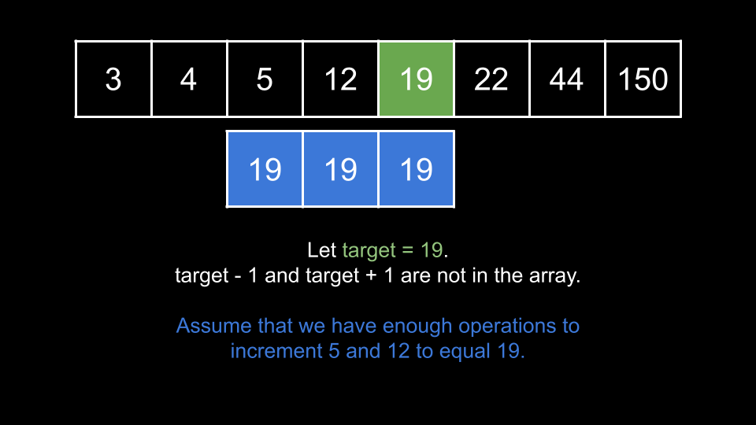
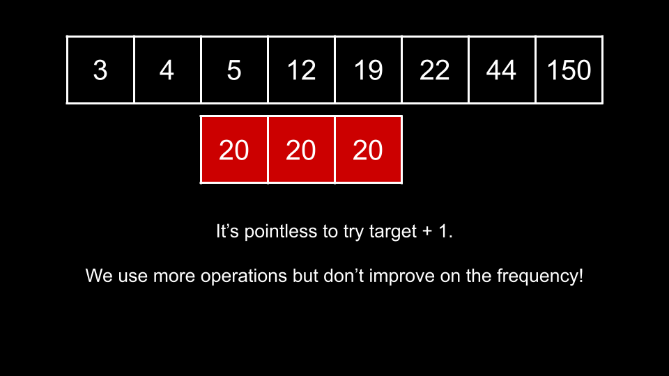
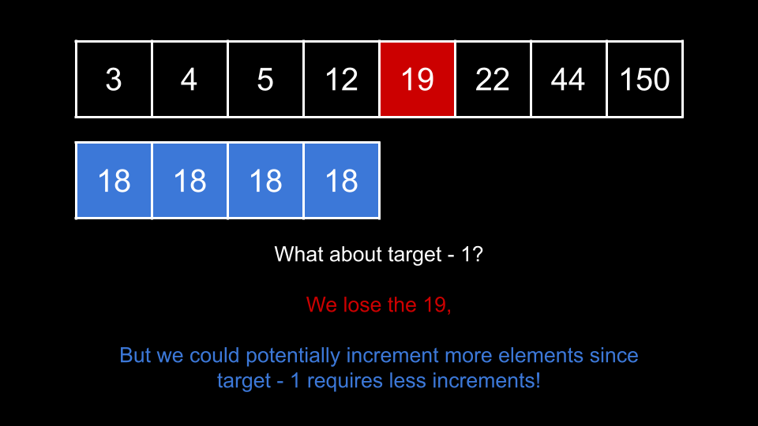
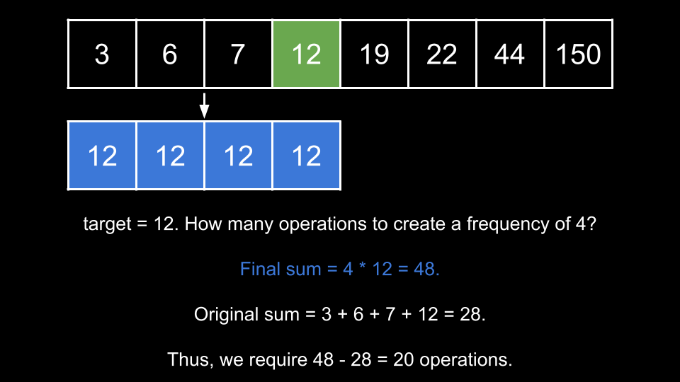

### Approach 1: Sliding Window

#### Intuition

In this problem, we want to make as many elements as we can equal using `k` increments.

Let's say that we choose a number `target` and want to maximize its frequency. Intuitively, the elements that we would increment would be the elements that are closest to `target` (and less than `target`, since we can only increment).

So what number should we choose for `target`? The optimal `target` will already exist in the array. Why?

Assume `target` is in `nums`, but `target - 1` and `target + 1` are not in `nums`. Let's say that we can increment `x` elements to be equal to `target` using at most `k` operations. We will prove that making `target - 1` or `target + 1` the most frequent element does not lead to better results.

It would be pointless to instead try to make `target + 1` the most frequent element, since this would cost us `x` extra operations and we would not improve on our answer. The same goes for even larger elements `target + 2` and etc.

What about `target - 1`? Compared with making `target` the most frequent element, we would lose the values representing these targets from our max frequency, but we would save `x` operations which we could potentially use to increment more than one extra element and thus improve our answer.

The above statement is true, but meaningless! Consider the greatest element in `nums` that is less than `target`. That is, if we were to sort `nums`, consider the element that comes right before `target`. If we were to instead consider this element as the `target`, we would save more than `x` operations without negatively affecting the frequency relative to considering `target - 1`.

In summary, for any given number absent that is not in `nums`, consider the greatest number in `nums` smaller than absent as `smallerTarget`. The number of operations to raise some number of elements to `smallerTarget` will always be less than the number of steps needed to raise them to absent.

Thus, the optimal value of target must exist in `nums`. We can iterate over `nums` and consider each element as `target`.
For a given value of `target`, how can we efficiently check the frequency we could achieve? As we mentioned at the start, we would want to increment elements that are closest to `target`. As such, we will start by sorting `nums` so that as we iterate over the elements, we know the elements closest to `target` are just to the left of `target`.

Now that `nums` is sorted, consider the first element to the left of `target` as `smaller`. As `smaller` is the closest element to `target`, we want to increment it to equal `target`. This will cost us `target - smaller` operations. Now, consider the next element to the left as `smaller2`. Now this is the element closest to `target`, so we increment it using `target - smaller2` operations. We continue this process until we run out of operations.

As you can see, the number of operations required is simply the difference between `target` and the numbers we are incrementing. Let's say that the final frequency of `target` was 4. We would have a sum of `4 * target`. The number of operations would be this sum minus the sum of the elements before we incremented them. Consider the following example:

> If you aren't already familiar with the sliding window technique, we highly recommend reading [this free article](https://leetcode.com/explore/interview/card/leetcodes-interview-crash-course-data-structures-and-algorithms/703/arraystrings/4502/) from LeetCode's official DSA course, where sliding window is explained in detail with multiple examples.

This brings us to our solution. We will use a sliding window over the sorted `nums`. For each element `nums[right]`, we will treat `target` as this element and try to make every element in our window equal to `target`.

The size of the window is `right - left + 1`. That means we would have a final sum of `(right - left + 1) * target`. If we track the sum of our window in a variable `curr`, then we can calculate the required operations as `(right - left + 1) * target - curr`. If it requires more than `k` operations, we must shrink our window. Like in all sliding window problems, we will use a while loop to shrink our window by incrementing left until `k` operations are sufficient.

Once the while loop ends, we know that we can make all elements in the window equal to `target`. We can now update our answer with the current window size. The final answer will be the largest valid window we find after iterating right over the entire input.

#### Algorithm

1. Sort `nums`.

2. Initialize the following integers:

    - `left = 0`, the left pointer.
    - `ans = 0`, the best answer we have seen so far.
    - `curr = 0`, the sum of the elements currently in our window.

3. Iterate right over the indices of `nums`:

    - Consider `target = nums[right]`.
    - Add `target` to `curr`.
    - While the size of the window `right - left + 1` multiplied by `target`, minus `curr` is greater than `k`:
        - Subtract `nums[left]` from `curr`.
        - Increment `left`.
    - Update `ans` with the current window size if it is larger.

4. Return `ans`.

Be careful! Given the constraints, we may run into integer overflow. Use long accordingly in Java and C++ (Python doesn't have overflow).

#### Complexity Analysis

Given `n` as the length of `nums`,

-   Time complexity: $O(n \cdot \log{}n)$

    -   Despite the while loop, each iteration of the for loop is amortized $O(1)$. The while loop only runs $O(n)$ times across all iterations. This is because each iteration of the while loop increments `left`. As `left` can only increase and cannot exceed `n`, the while loop never performs more than `n` iterations total. This means the sliding window process runs in $O(n)$.

    -   However, we need to sort the array, which costs $O(n \cdot \log{}n)$.

-   Space Complexity: $O(\log n)$ or $O(n)$

    -   We only use a few integer variables, but some space is used to sort.

    -   The space complexity of the sorting algorithm depends on the implementation of each programming language:

        -   In Java, Arrays.sort() for primitives is implemented using a variant of the Quick Sort algorithm, which has a space complexity of $O(\log n)$

        -   In C++, the sort() function provided by STL uses a hybrid of Quick Sort, Heap Sort and Insertion Sort, with a worst case space complexity of $O(\log n)$

        -   In Python, the sort() function is implemented using the Timsort algorithm, which has a worst-case space complexity of $O(n)$

### Approach 2: Advanced Sliding Window

#### Intuition

> This approach is an extension of the previous one.

Notice that the only thing we care about is the length of the longest window. We don't need to know what the window itself is. As we slide the window over the array, let's say we find a valid window with a length of `len`. We no longer care about any windows with lengths less than `len`, because they could not possibly improve on our answer.

The purpose of the while loop in the previous approach is to shrink the window until it is valid again. In this approach, we will not shrink the window - we will just try to grow it as large as we can.

We will keep the same condition in the while loop that checks if the current window `[left, right]` is valid, but instead of using a while loop, we will just use an if statement. This means `left` never increases by more than `1` per iteration. Because `right` also increases by `1` per iteration, if we cannot find a valid window, we will simply be sliding a window with static size across the array.

However, if we add an element `nums[right]` to the window and the window is valid, then the if statement will not trigger, and `left` will not be incremented. Thus, we will increase our window size by `1`. In this scenario, it implies the current window `[left, right]` is the best window we have seen so far.

As you can see, it is actually impossible for our window size to decrease, since each iteration increases `right` by `1` and `left` by either `0` or `1`.

Because our window size cannot decrease, it also means that the size of the window always represents the length of the best window we have found so far - analogous to `ans` from the previous approach.

At the end of the iteration, the size of our window is `n - left`. We return this as the answer.

#### Algorithm

1. Sort `nums`.

2. Initialize the following integers:

    - `left = 0`, the left pointer.

    - `curr = 0`, the sum of the elements currently in our window.

3. Iterate right over the indices of `nums`:

    - Consider `target = nums[right]`.

    - Add `target` to `curr`.

    - If the size of the window `right - left + 1` multiplied by `target`, minus `curr` is greater than `k`:

        - Subtract `nums[left]` from `curr`.

        - Increment `left`.

4. Return `nums.length - left`.

#### Complexity Analysis

Given `n` as the length of `nums`,

-   Time complexity: $O(n \cdot \log{}n)$

    -   Each iteration of the for loop costs $O(1)$. This means the sliding window process runs in $O(n)$.

    -   However, we need to sort the array, which costs $O(n \cdot \log{}n)$.

-   Space Complexity: $O(\log n)$ or $O(n)$

    -   We only use a few integer variables, but some space is used to sort.

    -   The space complexity of the sorting algorithm depends on the implementation of each programming language:

        -   In Java, Arrays.sort() for primitives is implemented using a variant of the Quick Sort algorithm, which has a space complexity of $O(\log n)$

        -   In C++, the sort() function provided by STL uses a hybrid of Quick Sort, Heap Sort and Insertion Sort, with a worst case space complexity of $O(\log n)$

        -   In Python, the sort() function is implemented using the Timsort algorithm, which has a worst-case space complexity of $O(n)$

### Approach 3: Binary Search

#### Intuition

> Note: the previous two approaches are the optimal solutions and are sufficient to solve the problem. Here, we will look at another unique way to approach the problem for the sake of completeness.

Given an index `i`, if we treat `nums[i]` as `target`, we are concerned with how many elements on the left we can take. In the earlier approaches, we used a sliding window. In this approach, we will directly find the left-most index of these elements using binary search.

Let's say that `best` is the index of the furthest element to the left that we could increment to `target = nums[i]`. Note that here, `best` is analogous to what `left` was after the while loop finished in the first approach. How do we find `best`?

The value of `best` must be in the range `[0, i]`. We will perform a binary search on this range. For a given index `mid`:

-   The number of elements in the window would be `count = i - mid + 1`.

-   Thus, the final sum after making every element in the window equal to target would be `finalSum = count * target`.

-   The original sum of the elements is the sum of the elements from index `mid` to index `i`. We can use a prefix sum to find this `originalSum`.

-   Thus, the number of operations we need is `operationsRequired = finalSum - originalSum`.

-   If `operationsRequired > k`, it's impossible to include the index `mid`. We update `left = mid + 1`.

-   Otherwise, the task is possible and we should look for a better index. We update `best = mid` and `right = mid - 1`.

Essentially, we are binary searching the left bound from the first approach for a given right bound `i`. If we pre-process a prefix sum, then for each `mid`, we have all the necessary information to find `operationsRequired`.

#### Algorithm

1. Define a function `check(i)`:

    - Initialize the following integers:

        - `target = nums[i]`, the current target.

        - `left = 0`, the left bound of the binary search.

        - `right = i`, the right bound of the binary search.

        - `best = i`, the best (furthest left) index that we can increment to `target`.

    - While `left <= right`:

        - Calculate `mid = (left + right) / 2`.

        - Calculate `count = i - mid + 1`.

        - Calculate `finalSum = count * target`.

        - Calculate `originalSum = prefix[i] - prefix[mid] + nums[mid]`.

        - Calculate `operationsRequired = finalSum - originalSum`.

        - If `operationsRequired > k`, move `left = mid + 1`.

        - Otherwise, update `best = mid` and `right = mid - 1`.

    - Return `i - best + 1`.

2. Sort `nums`.

3. Create a prefix sum of `nums`.

4. Initialize `ans = 0`.

5. Iterate `i` over the indices of `nums`:

    - Update `ans` with `check(i)` if it is larger.

6. Return `ans`.

#### Complexity Analysis

Given `n` as the length of nums,

-   Time complexity: $O(n \cdot \log{}n)$

    -   First, we sort nums which costs $O(n \cdot \log{}n)$.

    -   Next, we iterate over the indices of `nums`. For each of the $O(n)$ indices, we call `check`, which costs up to $O(\log{}n)$ as its a binary search over the array's elements. The total cost is $O(n \cdot \log{}n)$.

-   Space complexity: $O(n)$

    -   The prefix array uses $O(n)$ space.
