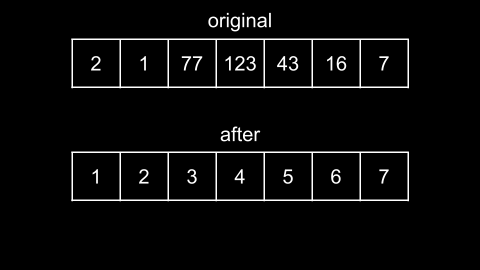
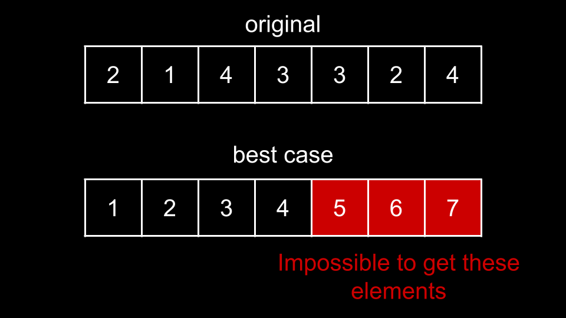
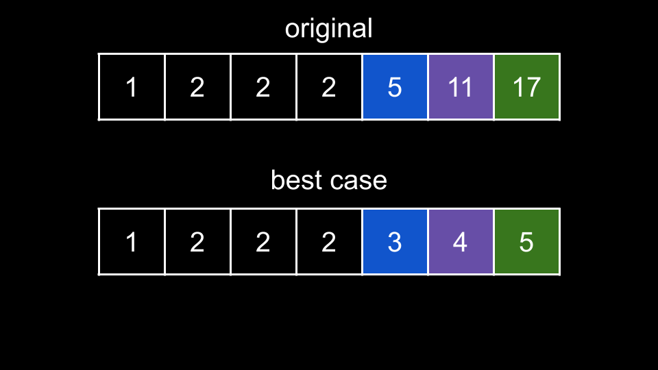
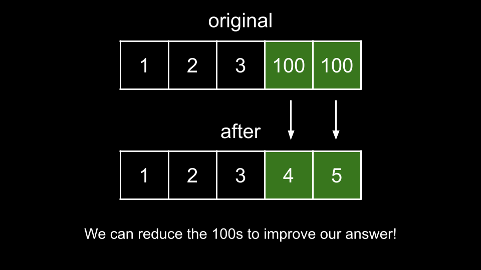
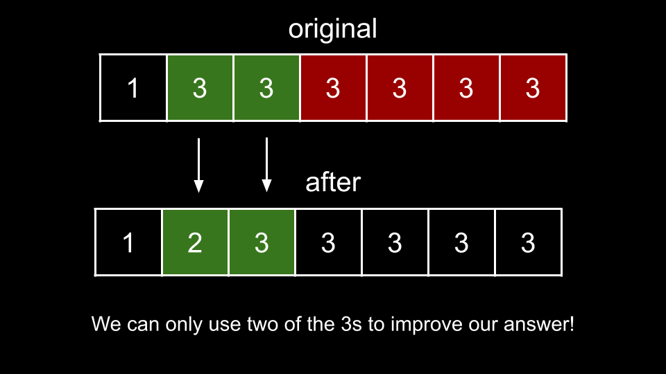

### Approach 1: Greedy

#### Intuition

In this problem, we need to maximize any value under the following rules:

1. `arr[0] = 1`.

2. Each adjacent element differs by at most `1`.

3. We can decrease any value, but we can't increase values.

4. We can rearrange values.

For an array of length `n`, the biggest value we could have is `n`. This scenario would be when the array is `[1, 2, 3, ..., n]`.

This is because each adjacent element differs by at most `1`, so the best we could do is to just count up from `1`, which the first element must be. When is this scenario impossible?

Because we are not allowed to increase elements, the best-case scenario is impossible when the original elements are not large enough to support the counting.

So what should our strategy be? We start at the first index with our answer `ans = 1`. This is because by the rules of the problem, the first element must be equal to `1`. Now, we iterate over the rest of the indices and try to increment by `1` each time.

If we can successfully increment, we update `ans = ans + 1`. We can successfully increment if there is an element in `arr` that is greater than or equal to `ans + 1`. Any element that is greater than or equal to `ans + 1` can be reduced to `ans + 1` according to the rules. However, once we reduce it, we can't use that element anymore in the future.

So which element should we choose at each step? We should greedily choose the smallest element that is greater than or equal to `ans + 1`. The reason we want the smallest element is because choosing a larger element does not give us any additional benefit - we will only increment our answer by `1` regardless. However, choosing the smallest element "saves" the larger elements to be reduced in the future.

For example, let's say you had `ans = 3` and there was a `4` and a `5` in the array. If you chose to reduce the `5` to a `4`, you would not be able to reach `ans = 5` anymore. However, if we use the `4` instead, then the `5` remains available when we want to increment `ans` to `5`.

Note that because we are allowed to rearrange elements freely, their initial order is irrelevant. As such, we will start by sorting `arr` so we can process the elements in ascending order.

We also initialize `ans = 1` and begin iterating over `arr`, starting from index `1`. The reason we skip index `0` is because a`rr[0] = 1` - we have no choice. At each index `i`, we try to increment ans by using `arr[i]`. If `arr[i]` is greater than or equal to `ans + 1`, then we can reduce `arr[i]` (or keep it the same) to `ans + 1`.

In the above example, we have an original sorted `arr = [1, 2, 2, 2, 5, 11, 17]`. Up to index `i = 3`, we cannot have `ans = 3` because none of the elements are large enough to support it. However, once we reach the `5`, we can reduce it to `3`. Then we reduce the `11` to `4` and the `17` to `5`. This makes sure we follow the rule where each adjacent element differs by at most `1` while also maximizing a value since we are incrementing at every opportunity.

#### Algorithm

1. Sort `arr` in ascending order.

2. Initialize `ans = 1`.

3. Iterate `i` over the indices of `arr`, starting from `i = 1`:

    - If `arr[i] >= ans + 1`, increment `ans`.

4. Return `ans`.

#### Complexity Analysis

Given `n` as the length of `arr`,

-   Time complexity: $O(n \cdot \log{}n)$

    -   We sort `arr` which costs $O(n \cdot \log{}n)$. Then, we iterate over it once which costs $O(n)$.

-   Space Complexity: $O(\log n)$ or $O(n)$

    -   The space complexity of the sorting algorithm depends on the implementation of each programming language:

        In Java, Arrays.sort() for primitives is implemented using a variant of the Quick Sort algorithm, which has a space complexity of $O(\log n)$

        In C++, the sort() function provided by STL uses a hybrid of Quick Sort, Heap Sort and Insertion Sort, with a worst case space complexity of $O(\log n)$

        In Python, the sort() function is implemented using the Timsort algorithm, which has a worst-case space complexity of $O(n)$

### Approach 2: No Sort

#### Intuition

While we are not directly sorting any data, this approach uses similar principles as Counting Sort.

Recall that in the best-case scenario of an array of length `n`, our answer will be `n`. This is because the first element must be `1`, and we can only increment by `1` for each additional element. Thus, we will never have any elements greater than `n` in our final array. Since our range of values is bounded by `[1, n]`, we don't actually need to sort the array. Instead, we will iterate over its bounded values in a more efficient way.

We will initialize an array `counts` as a counter, where `counts[x]` is equal to the frequency of `x` in `arr`. Because we don't care about values greater than `n`, if there are any numbers in `arr` that are greater than `n`, we will simply treat them as `n`. For example, if we had `arr = [1, 100, 100, 100]`, then we would have `counts[4] = 3`. Here, we have `n = 4`, so we treat each of the `100` as `4`, and thus the count of `4` is `3`.

Once we have the frequency of each element, we will follow a process similar to the one from the previous approach. First, we set `ans = 1`. Now, we iterate over each value num in the range `[2, n]`. For each value `num`, we check how many times `num` appears in `arr` by referencing `count[num]`. We have two possibilities:

-   `ans + count[num] <= num`. This would happen in a scenario like `[1, 2, 3, 100, 100]`. It means that there are less occurrences of `num` in `arr` than there are "spots" in the range `[ans + 1, num]`. In the above example, if `ans = 3` and we have `num = 100`, there are 97 "spots" between `3` and `100`: the spots are `4, 5, 6, ..., 99, 100`. Thus, we can reduce every instance of `num` to improve on `ans`, and we perform `ans += counts[num]`, resulting in `ans = 5`. Note that the case of `count[num] = 0` is handled by this scenario since adding `0` doesn't change anything.

-   `ans + count[num] > num`. This would happen in a scenario like `[1, 3, 3, 3, 3, 3, 3]`. It means there are more `num` than there are spots. In scenario 1, we are happy to reduce every instance of `num` to improve our answer. In this scenario, we can't improve our answer by reducing all of `num`, because we would need elements greater than `num`. So far, we can only raise `ans` to a maximum of `num`. Thus, we simply set `ans = num`.

The two possibilities can be summarized with the following line:

`ans = min(ans + counts[num], num)`

Essentially, at each `num`, we increment ans by filling as many "spots" as we can using reduced `num`. However, the total number of filled "spots" cannot exceed `num` as the range `[1, 2, ..., num]` is fixed and we cannot increase our current elements to be larger than `num`.

#### Algorithm

1. Initialize an array `counts` with length `n + 1` and values of `0`.

2. Iterate over each `num` in `arr`:

    - Increment `counts[min(num, n)]`.

3. Initialize `ans = 1`.

4. Iterate `num` from `2` to `n`:

    - Set `ans = min(ans + counts[num], num)`.

5. Return `ans`.

#### Complexity Analysis

Given `n` as the length of arr,

-   Time complexity: $O(n)$

    -   To calculate `counts`, we iterate over `arr` once which costs $O(n)$. Then, we iterate between 2 and n. which costs $O(n)$.

-   Space complexity: $O(n)$

    -   `counts` has a length of $n + 1$.
