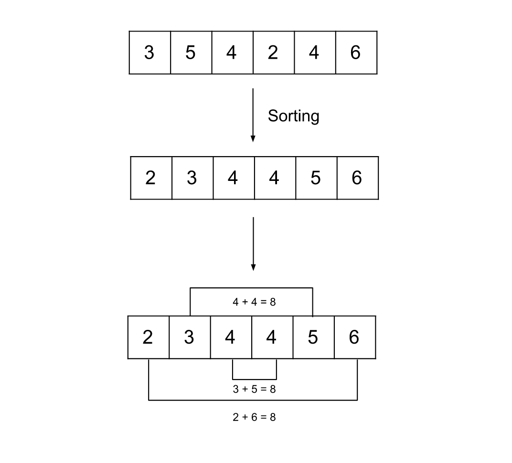

### Approach: Sorting

#### Intuition

We are given an array of `N` integers (where `N` is even), and we need to pair up all these integers in such a way that the maximum sum of a pair is minimized. We need to return the minimized maximum pair sum in the array.

One might think of pairing up the smaller integers together so that the pair sum is minimized at the beginning. However, in this way, we will end up pairing the bigger integers together and hence will increase the maximum pair sum. For example, we can pair up the array `[1, 1, 2, 3]` as `(1, 1)`, `(2, 3)` with maximum sum as `5`. However, the optimal way would be to make a pair like `(1, 3)`, `(1, 2)` with a maximum sum of `4`. This suggests that pairing adjacent numbers by value may not be the optimal approach.

Observing the above example we can think about another potential strategy to pair up the smallest integer with the greatest integer and then second-smallest with the second-greatest and so on. This method ensures we don't end up pairing the two greatest integers as we did in the previous method. But how can we know this is optimal and would always produce the minimum pair sum?

Suppose we have the array $[a_1, a_2, ..., a_n]$, where these integers are sorted in ascending order and so $a_1$ is the minimum integer and $a_n$ is the greatest one in the array. As per the above potential solution, we will pair up $a_1$ and $a_n$ together, we can try to prove this method wrong by contradiction. Let's say we assume there exist two integers in the array $a_{i}$ and $a_{j}$ and satisfy this:

-   $a_1 \le a_i \le a_n$
-   $a_1 \le a_j \le  a_n$

Let's assume an opposite method, and prove that it leads to contradiction. Suppose the pair $[(a_{1}, a_{i}), (a_{n}, a_{j}) ]$ is optimal than pair $[(a_{1}, a_{n}), (a_{i}, a_{j}) ]$. This is however not true, because $a_{j} + a_{n}$ is always bigger than or equal to $a_{i} + a_{1}$, hence the max of $[(a_{1}, a_{i}), (a_{n}, a_{j}) ]$ will always be $a_{j} + a_{n}$. And no matter what's the max of $[(a_{1}, a_{n}), (a_{i}, a_{j}) ]$ it will always be smaller than or equal to $a_{j} + a_{n}$. Therefore, our potential solution strategy is optimal.

The image below demonstrates the pairing:

Therefore, we will sort the integers in the array and then pair the integers at the left end with the integers at the right end. The minimum value is paired with the maximum value, the next smallest value is paired with the next largest value, and so on. We need to iterate over only the first half of the array because the corresponding second element in the pair can be found by using the length of the array.

#### Algorithm

1. Sort the array `nums`.

2. Initialize the variable `maxSum` to `0`.

3. Iterate over the array `nums` from index `0` to `nums.length() / 2 - 1`.

4. Get the sum of the current element and its corresponding pair `nums[i] + nums[nums.length() - 1 - i]`, and update `maxSum` if the sum is larger.

5. Return `maxSum`.

#### Complexity Analysis

Here, `N` is the number of elements in the array nums.

-   Time complexity $O(N \log N)$

    -   Sorting the array nums will take $O(N \log N)$ time, and then we iterate over the array nums which will take $O(N)$ time. Hence, the total time complexity is equal to $O(N \log N)$.

-   Space complexity $O(\log N)$

    -   We don't need any extra space apart from the one required for sorting. The space complexity of the sorting algorithm depends on the implementation of each programming language. For instance, in Java, the Arrays.sort() for primitives is implemented as a variant of the quicksort algorithm whose space complexity is $O(\log N)$. In C++ std::sort() function provided by STL is a hybrid of Quick Sort, Heap Sort, and Insertion Sort and has a worst-case space complexity of $O(\log N)$. Thus, the use of the inbuilt sort() function might add up to $O(\log N)$ to space complexity.
