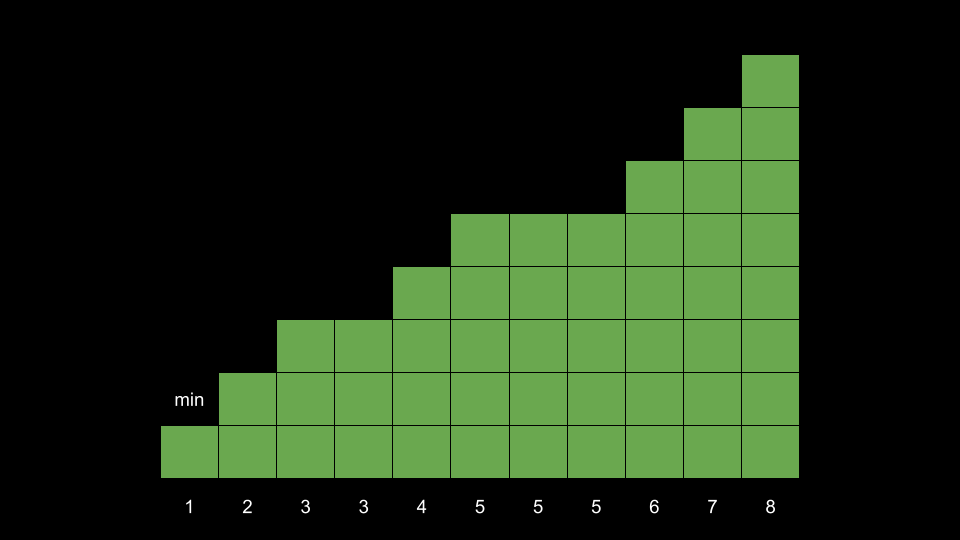
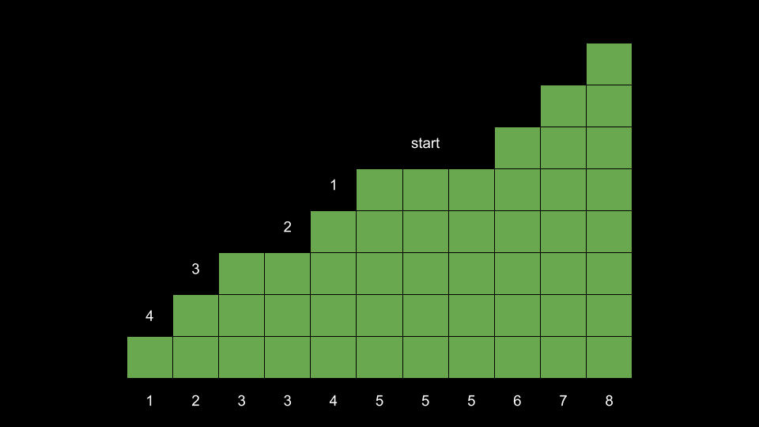

### Approach: Sort and Count

#### Intuition

The problem description describes the following process:

1. Find the largest value
2. Decrease it to the second largest unique value
3. Repeat

The termination condition is when all elements are equal. However, you may notice that in the end, the elements will always be equal to the original minimum element. Thus, we can reframe the problem as "How many operations are required to reduce every number to the minimum element?

Let's say the minimum element is `min`. We need to reduce every element to `min`. Because we operate on the largest elements first, let's start by sorting the array so we can easily access the elements in order.

We start by reducing 8 to 7. Now that we have two 7, the problem states that we should choose the one with the smaller index to reduce first. However, the order doesn't really matter because eventually, both of these 7 will be reduced to 6 anyways. For now, let's focus on only one of them (the index of the number that was originally 8).

So far we have used two operations on the original 8. One to reduce it to 7, and another to reduce it to 6. We now have three 6. Eventually, all of them will be reduced to 5. Again, let's just focus on the original 8.

Now, we have used three operations on the original 8. We reduced it to 7, then 6, and now 5. This process continues. Eventually, we will reduce it to 4, then 3, then 2, and finally `min = 1`.

As you can see, the original 8 was reduced to each unique element in the array less than it. There were many operations done on other numbers in between, but if we were to focus ONLY on the original 8 and the operations performed on it, we find that the number of operations is equal to the count of unique numbers less than 8.

An intuitive way to think about this is by imagining the array as a staircase. Starting at the highest step 8, each step down is equivalent to a reduction operation. The number of steps to the bottom is the number of operations required to reduce 8 to `min`.

In fact, this idea extends to every position in the array!

For each position, we can find the number of operations required to reduce the number to `min` by counting the number of steps we take down. The following image has each position annotated with the number of steps/operations required.

Here, let's emphasize once again that in the actual execution of the operations, we wouldn't continuously reduce a number to `min` because it may involve operations on other numbers as well (for example, before we reduce the representation of 8 to 6, we also need to lower another 7 to 6). However, for the sake of simplicity in calculations, we are only focusing on a series of operations involving the number we select.

The answer to the problem is simply the sum of all these numbers. How can we efficiently calculate the number of operations required at each step?

An important observation to make is that the number of steps down from a position to `min` is equal to the number of steps up from `min` to that same position.

After we sort the array, iterating over it from left to right would be like "walking" up the staircase. Each time we encounter an index `i` where `nums[i] != nums[i - 1]`, we know that we had to take a up step. We can simply keep track of how many up steps we have taken so far in an integer `up`. We need up steps to reach `nums[i]`, which also means that `nums[i]` needs up operations to be reduced to `min`. Therefore, at each step, we increment our answer by `up`.

#### Algorithm

1. Sort `nums`.

2. Initialize the answer `ans` = 0 and the number of up steps taken so far `up` = 0.

3. Iterate `i` over the indices of `nums`, starting with `i = 1`:

    - Check if `nums[i] != nums[i - 1]`. If so, increment `up`.

    - Add `up` to `ans`.

4. Return `ans`.

#### Complexity Analysis

Given `n` as the length of `nums`,

-   Time complexity: $O(n \cdot \log{}n)$

    -   Sorting the array requires $O(n \cdot \log{}n)$ time.

    -   After sorting, we iterate over the array once, performing $O(1)$ work at each iteration. Thus, the for loop requires $O(n)$ time.

-   Space Complexity: $O(\log n)$ or $O(n)$

    -   We are using $O(1)$ space for variables. However, sorting the input requires some space.

    -   The space complexity of the sorting algorithm depends on the implementation of each programming language:

        -   In Java, Arrays.sort() for primitives is implemented using a variant of the Quick Sort algorithm, which has a space complexity of $O(\log n)$

        -   In C++, the sort() function provided by STL uses a hybrid of Quick Sort, Heap Sort and Insertion Sort, with a worst case space complexity of $O(\log n)$

        -   In Python, the sort() function is implemented using the Timsort algorithm, which has a worst-case space complexity of $O(n)$
