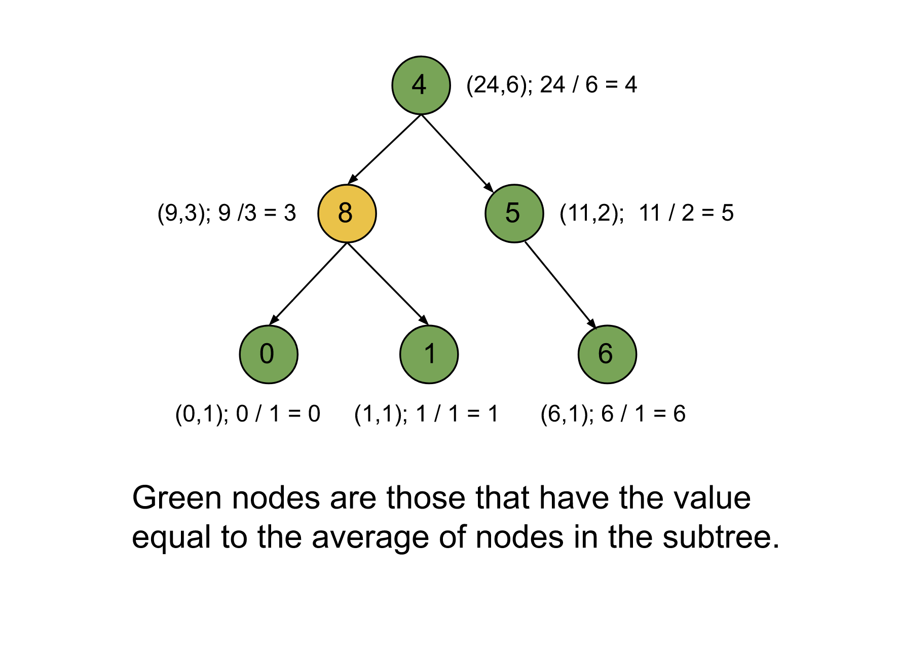

### Approach: Depth First Search (DFS)

#### Intuition

We are given a binary tree with nodes that have non-negative integer values. We need to return the number of nodes that have the same value as the average value of all the nodes that have that node as their root (and the root node is included in the subtree). To find the average, we can round down the value to the nearest integer.

To find the average of some integers, we have two requirements. One is the sum of all the integers, and the other one is the number of integers. If we have both of these, we can find the average by dividing the sum by the number of integers. In this problem, we need the sum of all the nodes in the subtree Sum of nodes, and the second is the number of nodes in the subtree Number of nodes. We can then find the average as the Sum of nodes / Number of nodes.

One naive way to do this is to iterate over each node in the binary tree and then iterate over the subtree starting with this node, keeping the sum of nodes and count of nodes in two variables. Then, after completing the subtree, we will check if the average is equal to the root node value. If it is, we will increment the count of the answer variable. This approach is, however, inefficient as we will be iterating over the nodes multiple times. For each node, we will have to iterate over the nodes in the subtree, even if they have already been traversed.

In the above approach, we have to iterate over the nodes multiple times because we have started from top to bottom and as a result, we are not able to reuse the sum and count. Instead of going from to root node to the leaves, we can iterate in the reverse manner. We will first iterate over the left and right subtree of each node and return the sum of nodes as well as the count of nodes, Then we can find the average and check if this node should be counted. We will repeat the process for each node and return the final count once we have iterated over all the nodes.

If we look closely, traversing the children before traversing the nodes is a depth-first search traversal. We will use a recursive function that will return a pair of integers where the first integer is the sum of the nodes and the second integer is the count of the nodes. Using the pairs returned from the left and right subtrees, we can find the number of nodes in the total subtree and the total number of nodes. We can then find the average and determine whether the node should be counted in the final answer.

Note that at the current node when we get the node values sum and count of nodes in both the left and right subtree, we add these values along with the current node value to get the total sum of this subtree and we add one to the total nodes to get the total nodes.

#### Algorithm

1. Define the method postOrder which takes a node root and returns a pair of integers, where the first integer is the sum of all nodes in the subtree under root and the second integer is the count of a node in the subtree under root. postOrder will include these steps:

2. Return a pair with (0, 0) if the root is NULL.

3. Recursively call postOrder for the left and the right child of the root and store the pairs as left and right respectively.

4. Find the total sum under root as the sum of nodes in the pair left, and right and the root itself as nodeSum.

5. Find the total node count under root as the count of nodes in the pair left, and right and the 1 for the root as nodeCount.

6. Find the average using nodeSum and nodeCount and increment the counter count if the average is equal to the root value.

7. Return a pair as (nodeSum, nodeCount).

8. When postOrder is finished, return count.

#### Complexity Analysis

Here, N is the number of nodes in the binary tree.

- Time complexity O(N)

  We need to iterate over each node in the binary tree only once, and all other operations, like finding the average, are O(1), and hence the total time complexity is equal to O(N).

- Space complexity O(N)

  Recursion requires some stack space, and the maximum number of active stack calls would be equal to N (one for each node). The space required by the pair is O(1) and hence the total space complexity is equal to O(N).
