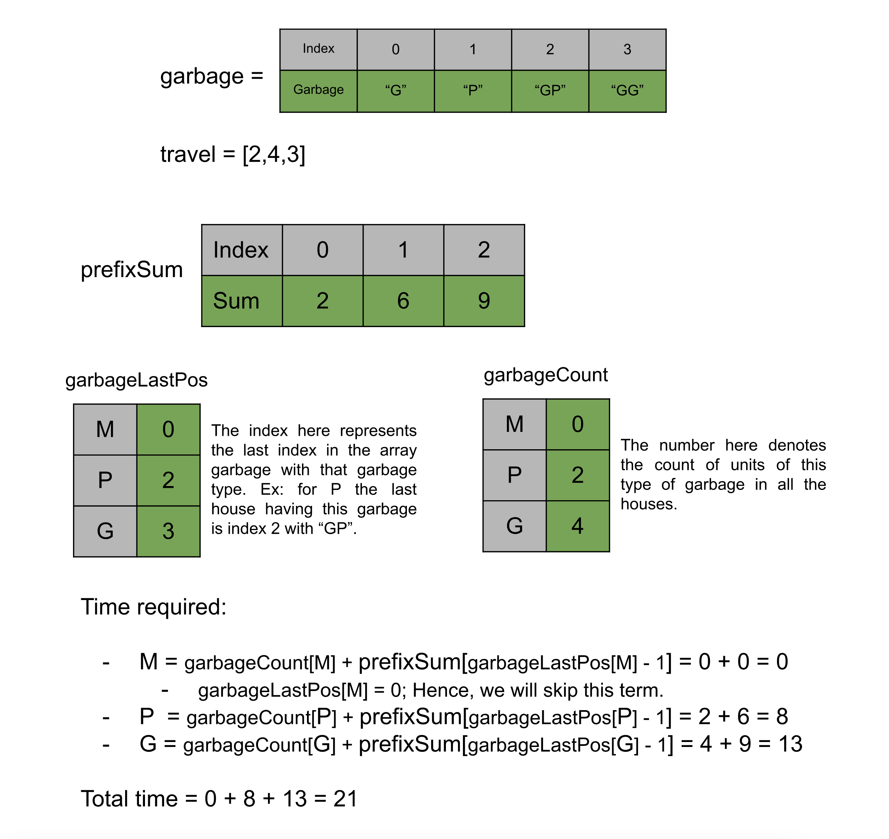

### Approach 1: HashMap

#### Intuition

The first observation we can make from the problem statement is that all three trucks will pick up only one type of garbage and hence they all will work independently. In other words, the order of different trucks will not matter. Now, let's try to find the minimum time required for a truck to collect a certain type of garbage (say type M). Since we need to collect all the garbage M and picking one unit of garbage M takes one unit of time, the count of garbage M in all the houses is the minimum amount of time required for the truck to collect this type of garbage.

Now, we need to find the minimum time required for the truck to travel across the houses to reach all the M type garbage. Each truck will start from house `0`, but it doesn't have to go to each house. Also, the truck can only visit houses in order. So if there is no garbage of type M at the last house the truck doesn't have to go to the last house. This implies that the truck only needs to travel to the last house having that type of garbage. For example, if the truck needs to collect the M type garbage and the houses are `["G","P","MGP","GG"]`, then the truck only needs to travel from index 0 to 2.

Therefore, we will find the time required for each truck separately. For each type of garbage, we will find the total count in all the houses (say `x`) and also find the index of the last house having this garbage (say `i`). The time to collect this type of garbage will be `x + travel[0] + travel[1] + ... + travel[i - 1]`, this is because the truck will need to travel all houses from index `0` to index `i` , and `travel[i - 1]` is the time to travel from the house at index `i - 1` to `i`. To find the sum of the first `i` elements in the array `travel`, we will create a prefix sum array to fetch it in constant time. This array `prefixSum` will start from index one (`prefixSum[0]` will be `0`, since the truck starts from the house `0`). This way, when we need to find the total time to reach house `0`, we can find it in `prefixSum[0]`, and the total time to reach house `1` will be found in index `prefixSum[1]`, and so on.

#### Algorithm

1. Initialize an array `prefixSum` of the size `travel.length + 1`, the i^th value in this array will store the sum of first `i - 1` elements in the array `travel`.

2. Initialize an empty map `garbageLastPos` from character to integer, this map will store the last index of the house for the type of garbage equal to the key.

3. Initialize an empty map `garbageCount` from character to integer, this map will store the count of the type of garbage represented by the key in all the houses.

4. Iterate over the array `garbage` and iterate over each garbage for each house, increment the count in `garbageCount` and store the index in the map `garbageLastPos`.

5. Iterate over each garbage type and for each type (say `c`) add the `garbageCount[c]` and `prefixSum[garbageLastPos[c]]` to the answer variable `ans`.

6. Return `ans`.

#### Complexity Analysis

Here, `N` is the number of houses in the array garbage, and `K` is the maximum length `garbage[i]`.

-   Time complexity $O(N \cdot K)$

    -   We first iterate over the array `travel` to create the `prefixSum`, the size of `travel` is `N` and hence this will take $O(N)$ time. We then iterate over the `garbage` array and for each string in the array we iterate over each character to store info in the maps `garbageLastPos` and `garbageCount`, this operation will take $O(N \cdot K)$ time. In the end, we just iterate over the three garbage types and add the corresponding answer to `ans`. Hence, the total time complexity is equal to $O(N \cdot K)$

-   Space complexity $O(N)$

    -   We have created an array `prefixSum` of size `N`. We also have the maps to store the last position and the count, however, the space required by these maps can be considered constant as the only keys we need are three (M, P, G). Therefore, the total space complexity can be written as $O(N)$.

### Approach 2: HashMap and In-place Modification

#### Intuition

> Note: This approach requires altering of given input which is generally not recommended. This approach has been added for the sake of competition and should be discussed in an interview setting only if asked explicitly.

Let's try to save some space in our previous approach. Due to the array `prefixSum` we have incurred $O(N)$ space in our previous approach. To save space here, we can store the prefix sums in the `travel` array itself instead of creating a new array. This will work because we only need the `travel` array for the prefix sums and not the individual values. Another optimization that can be done is for the map `garbageCount`, where we store the count of each garbage type, however, instead of returning the time to collect each type of garbage, we only need to return the total time to collect all the garbage. Therefore, we can store the total count of all garbage in a variable instead of a map.

#### Algorithm

1. Create the prefix sum array `travel` by using the equation `travel[i] = travel[i - 1] + travel[i]`.

2. Initialize an empty map `garbageLastPos` from character to integer, this map will store the last index of the house for the type of garbage equal to the key.

3. Iterate over the array `garbage` and iterate over each garbage for each house, store the index in the map `garbageLastPos` and add the length of `garbage[i]` to the variable `ans`.

4. Iterate over each garbage type and for each type (say `c`) add the `prefixSum[garbageLastPos[c] - 1]` to the answer variable `ans`.

5. Return `ans`.

#### Complexity Analysis

Here, `N` is the number of houses in the array `garbage` and `K` is the maximum length of `garbage` in the array `garbage`.

-   Time complexity $O(N \cdot K)$

    -   We first iterate over the array `travel` to create the `prefixSum`, the size of travel is `N` and hence this will take $O(N)$ time. We then iterate over the `garbage` array and for each string in the array we iterate over each character to store info in the maps `garbageLastPos` and `garbageCount`, this operation will take $O(N \cdot K)$ time. In the end, we just iterate over the three garbage types and add the corresponding answer to `ans`. Hence, the total time complexity is equal to $O(N \cdot K)$

-   Space complexity $O(1)$

    -   The only extra space we used is the map to store the last position, however, the space required by this map can be considered constant as the only keys that we need are three (M, P, G). Therefore, the total space complexity is constant.
