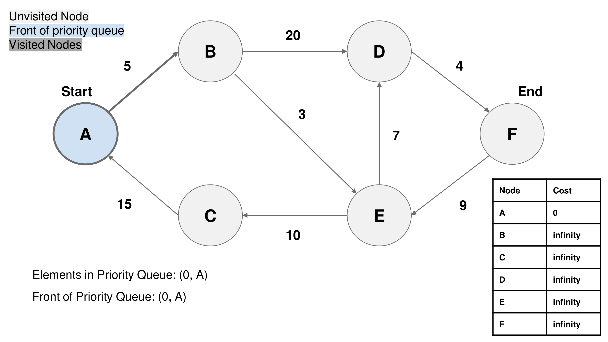
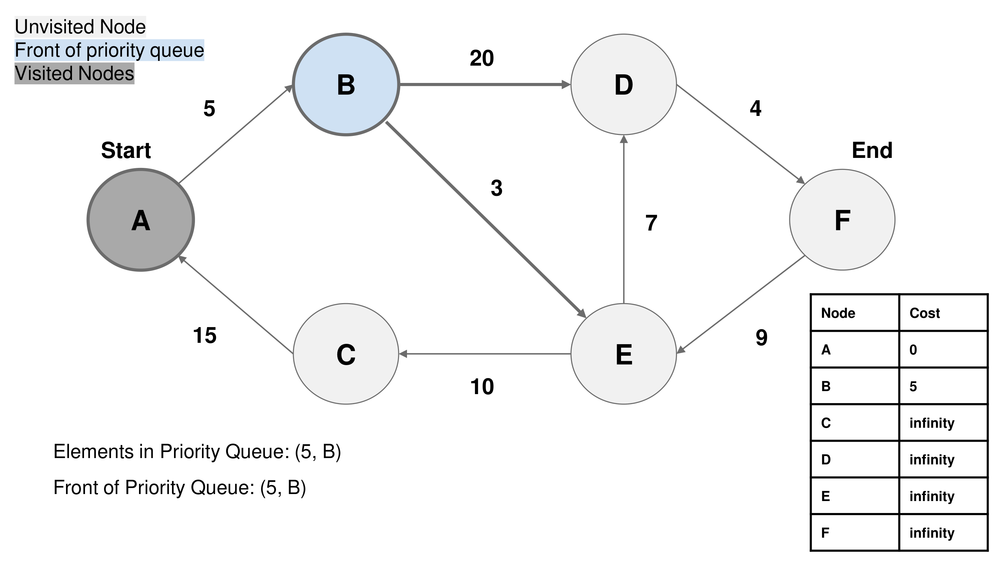
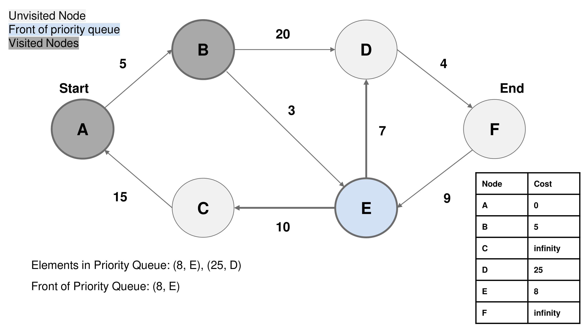
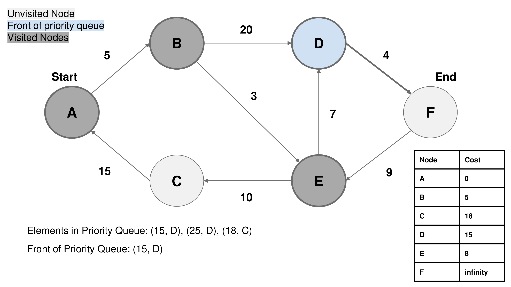
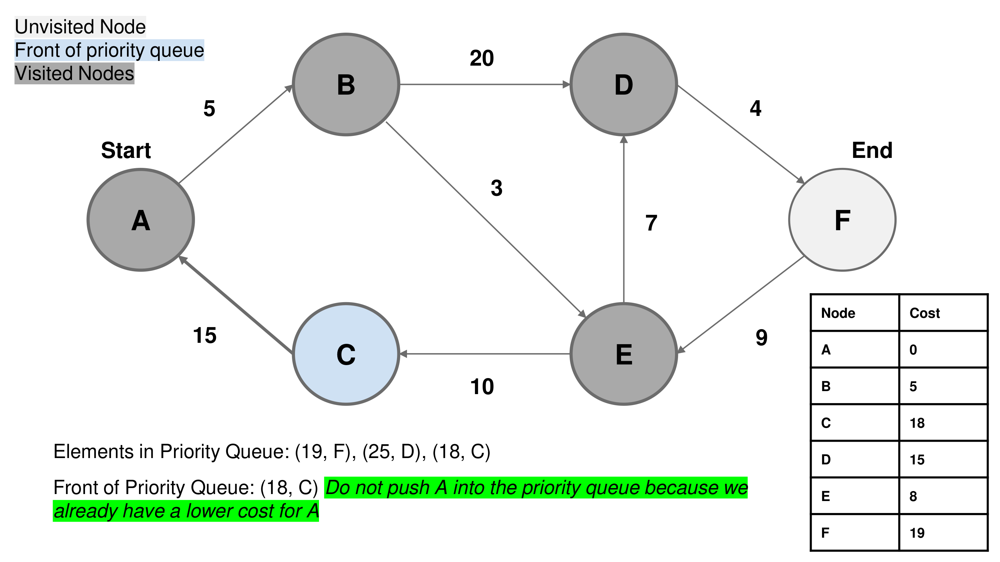
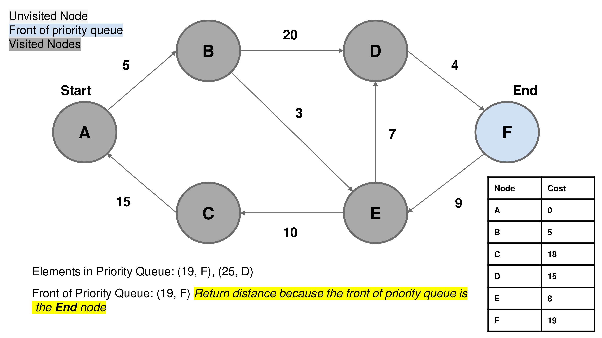

### Overview

Imagine you're tasked with navigating a complex web of interconnected locations, each with its unique path and cost associated with traveling from one place to another. This is precisely the challenge presented in this problem.

You're given a directed weighted graph, represented by an array of edges. Each edge signifies a one-way connection between two locations, complete with a cost. Your mission is to create a "Graph" class that can efficiently manage this network and provide two essential services.

1. **Setting Up the Map** (`Graph(int n, int[][] edges)`): Just like preparing a map for a journey, you initialize the graph with "n" locations and the given edges. This step lays out the foundation for your navigation.

2. **Plotting New Routes** (`addEdge(int[] edge)`): As your journey unfolds, you'll come across new routes. The "addEdge" method allows you to add these paths to your map. It's worth noting that this method ensures no duplicate paths between locations.

3. **Finding the Optimal Path** (`int shortestPath(int node1, int node2)`): The core of this adventure lies in discovering the shortest and most cost-effective path from one location to another. This method calculates the minimum cost required to travel from "node1" to "node2." If a path doesn't exist, it signals your GPS to return -1.

Solving this problem involves creating a powerful navigation tool (the "Graph" class) that not only builds and updates the map as new routes are discovered but also efficiently guides you to your destination, ensuring that you reach your target location with the least possible cost.

This problem mirrors real-world scenarios where you might be navigating transportation networks, optimizing data flow in networks, or even finding the shortest connections in social networks. So, crafting a robust solution here not only solves the immediate challenge but can also have practical applications in various fields.

### Approach 1: Dijkstra's Algorithm

#### Intuition

If you are not familiar with Dijkstra's Algorithm, please refer to our explore cards [Dijkstra's Algorithm](https://leetcode.com/explore/learn/card/graph/622/single-source-shortest-path-algorithm/3862/). We will focus on the usage in this article and not the underlying principles or implementation details.

We first use Dijkstra's algorithm, a well-known method for finding the shortest path in weighted graphs, which is particularly effective for this type of problem. The algorithm maintains a priority queue of nodes to explore, prioritizing those with the lowest tentative distances.

We begin by setting the cost of the source node to 0 and enqueue it in a priority queue. Simultaneously, we initialize an array to store the cost associated with each node when starting from the source node. While there are nodes remaining in the queue, we dequeue the node with the lowest cost, examine whether it corresponds to the destination node, and return its cost if it does. If not, we explore its neighboring nodes, compute new costs for the neighboring nodes, and if these new costs are lower than the previously recorded costs in our node cost array, we enqueue the neighboring nodes into the priority queue. In the event that the destination node cannot be reached, we return -1 to indicate the absence of a viable path.

We implement this approach by creating a `Graph` class with methods for initialization, adding edges, and finding the shortest path using Dijkstra's algorithm. This approach logically addresses the problem's requirements while leveraging a well-established algorithm for efficiency and correctness.

#### Algorithm

1. **Initialization**:

    - When we initialize the `Graph` class with `n` nodes and a list of `edges`, we create an adjacency list representation for the directed weighted graph.

    - We initialize an empty adjacency list `adj_list`, where each node's outgoing edges will be stored along with their cost.

2. **Adding Edges**:

    - When we call the `addEdge` method to add an edge to the graph, we provide an `edge` in the form of a list `[from, to, edgeCost]`.

    - We extract the `from_node`, `to_node`, and `cost` from the input edge.

    - We append a tuple/pair `(to_node, cost)` to the adjacency list entry for `from_node`. This represents a directed edge from `from_node` to `to_node` with the specified `cost`.

3. **Shortest Path Calculation**:

    - When we call the `shortestPath` method to find the minimum cost path from `node1` to `node2`, we use Dijkstra's algorithm.

    - We initialize an array `costForNode` to keep track of the minimum costs to reach each node when starting from `node1` and a priority queue `pq` to explore nodes in ascending order of their accumulated cost from `node1`.

    - We set `costForNode[node1]` to `0` since we are starting here.

    - We start by adding `(0, node1)` to `pq` with an initial cost of `0` for `node1`.

    - While `pq` is not empty, we continue exploring nodes.

    - For each iteration:

        - We pop the node with the smallest accumulated cost (`curr_cost`) from `pq`.

        - If `curr_node` is equal to `node2`, we have found the shortest path, and we return `curr_cost`.

        - We iterate through the neighbors of `curr_node` stored in the adjacency list.

        - For each `neighbor`, we calculate the new cost (`new_cost`) by adding the cost of the current edge to the `curr_cost`.

        - If the `neighbor`'s `new_cost` is less than its cost in `costForNode` (`costForNode[neighbor]`), we add `(new_cost, neighbor)` to `pq`, which means we will explore this neighbor with the updated cost. We additionally assign the value of `new_cost` to `costForNode[neighbor]`.

    If the priority queue is empty and we have not found `node2`, it means there is no path from `node1` to `node2`, so we return `-1`.

### Complexity Analysis

Let `E` be number of edges in the graph when the call to any method is made.
Let `V` be the number of vertices in the graph when the call to any method is made.
Let `N` be the maximum number of calls made to `addEdge`.
Let `M` be the maximum number of calls made to `shortestPath`.

-   Time complexity: $O(N + M\cdot (V + E\cdot logV))$

    -   initialization: $O(E + V)$. Initializing a list to the size of `V` costs $O(V)$ and iterating over all the edges costs $O(E)$

    -   `addEdge`: $O(N)$. Appending an element to a list costs $O(1)$, and when this operation is performed `N` times, it results in a linear time complexity of $O(N)$.

    -   `shortestPath`: $O(M\cdot (V + E\cdot logV))$. Initializing the `seen` list will incur a time complexity of $O(V)$. The time complexity for Dijkstra's algorithm is $(E\cdot logV)$. Calling `shortestPath` `M` times leads to a combined time complexity of $O(M\cdot (V + E\cdot logV))$.

-   Space complexity: O(E+V+N)O(E + V + N)O(E+V+N)

    -   initialization: $O(E + V)$. This is the cost to initialize the adjacency list.

    -   `addEdge`: $O(N)$. Adding an element in the adjacency list will incur a space complexity of $O(1)$, and when this operation is performed `N` times, it results in a linear space complexity of $O(N)$.

    -   `shortestPath`: $O(E + V)$. The `seen` list will incur a space complexity of $O(V)$. The priority queue will will incur a space complexity of $O(E)$.

### Approach 2: Floyd–Warshall algorithm

#### Intuition

We start by considering how to represent the graph. Given that it's a weighted directed graph, we opt for an adjacency matrix to store the edge costs between nodes. This matrix, `adj_matrix`, will be initialized with a very large value (infinity) to signify that there's no direct edge between two nodes.

In the constructor, we take the number of nodes `n` and the initial edges as input. We initialize the adjacency matrix with infinity values for all pairs of nodes. Then, we iterate through the given edges and update the corresponding positions in the adjacency matrix with the edge costs. To maintain consistency, we also set the diagonal entries to `0` since the cost from a node to itself is zero.

**Floyd-Warshall Algorithm**: We recognize the need to find the shortest paths between all pairs of nodes efficiently. To achieve this, we implement the Floyd-Warshall algorithm. We use nested loops to iterate through all possible intermediate nodes (`k`), source nodes (`i`), and destination nodes (`j`). For each pair of nodes (`i, j`), we update the minimum cost if there's a shorter path through the intermediate node (`k`).

In the `addEdge` method, we address the requirement to add a new edge to the graph. We take the edge information as input (`from_node`, `to_node`, and `cost`). To update the adjacency matrix efficiently, we iterate through all pairs of nodes (`i, j`) and check if the path from i to j can be improved by going through the newly added edge. If there's an improvement, we update the cost accordingly. This is commonly known as the "relaxation" step.

**Finding Shortest Path**: In the `shortestPath` method, we provide a simple interface for users to find the shortest path between two nodes. We return the cost stored in the adjacency matrix for the given pair of nodes (`node1, node2`). Since we have already relaxed all paths in the `addEdge` method, the adjacent matrix is guaranteed to store the cost of the shortest path. If the cost is still infinite, it indicates there's no path between those nodes, and we return `-1`.

The key insight here is that the Floyd-Warshall algorithm efficiently computes the shortest paths between all pairs of nodes, making the `shortestPath` method fast and time-constant.

### Algorithm

1. **Initialization**:

    - When we initialize the `Graph` class with `n` nodes and a list of edges, we create an adjacency matrix representation for the directed weighted graph.

    - We initialize an empty adjacency matrix `adj_matrix` of size `n x n`, where `n` is the number of nodes.

    - For each edge in the input edges, we update the corresponding entry in the adjacency matrix with the provided cost.

    - We set the diagonal elements of the adjacency matrix to `0` because the cost to reach a node from itself is always `0`.

2. **Floyd-Warshall Algorithm**:

    - After initializing the adjacency matrix, we apply the Floyd-Warshall algorithm to compute the shortest paths between all pairs of nodes.

    - We use three nested loops:

        1. The outermost loop iterates over all intermediate nodes (indexed by `i`).

        2. The middle loop iterates over all source nodes (indexed by `j`).

        3. The innermost loop iterates over all destination nodes (indexed by `k`).

    - During each iteration, we update the entry `adj_matrix[j][k]` by taking the minimum of its current value and the sum of the values `adj_matrix[j][i]` and `adj_matrix[i][k]`. This represents the minimum cost to reach node `k` from node `j` via an intermediate node `i`.

3. **Adding Edges**:

    - When we call the `addEdge` method to add an edge to the graph, we provide an edge in the form of a list `[from, to, edgeCost]`.

    - We iterate over all pairs of nodes in the adjacency matrix and update the entry `adj_matrix[i][j]` by taking the minimum of its current value and the sum of the values `adj_matrix[i][from_node]`, `adj_matrix[to_node][j]`, and `cost`. This represents the updated minimum cost considering the new edge.

4. **Shortest Path Calculation**:

    - When we call the `shortestPath` method to find the minimum cost path from `node1` to `node2`, we check if the value at `adj_matrix[node1][node2]` is still equal to infinity. If it is, there is no path between the two nodes, so we return `-1`.

    - Otherwise, we return `adj_matrix[node1][node2]`, which represents the minimum cost to reach `node2` from `node1` based on the computed shortest paths.

#### Complexity Analysis

Let `E` be number of edges in the graph when the call to any method is made.
Let `V` be the number of vertices in the graph when the call to any method is made.
Let `N` be the maximum number of calls made to `addEdge`.
Let `M` be the maximum number of calls made to `shortestPath`.

-   Time complexity: $O(M + N\cdot V^2 + V^3)$

    -   initialization: $O(V^3)$. The Floyd-Warshall Algorithm incurs a cost of $O(V^3)$ to find the minimum cost between all pairs of vertices.

    -   `addEdge`: $O(N\cdot V^2)$. When adding an edge, we iterate over the whole matrix to check if the new edge lowers the cost between any of the vertices. This operation costs $O(V^2)$. When this operation is performed `N` times, it results in a time complexity of $O(N\cdot V^2)$.

    -   `shortestPath`: $O(M)$. Finding the `shortestPath` doesn't require any additional computation. Hence, it incurs a constant time complexity of $O(1)$. When this operation is performed `M` times, it results in a linear time complexity of $O(M)$.

-   Space complexity: $O(V^2)$

    -   initialization: $O(V^2)$. We initialize a 2-D adjacency matrix that stores the minimum cost between all vertices. This matrix incurs a cost of $O(V^2)$.

    -   `addEdge`: $O(1)$. We will not need any extra space to add an edge.

    -   `shortestPath`: $O(1)$. We will not need any extra space to return the cost of the shortest path.

---

### Notes:

If there is a significant imbalance between the frequency of `shortestPath` calls compared to the frequency of `addEdge` calls, the choice between using the Floyd-Warshall algorithm and Dijkstra's algorithm should be based on the number of times these two operations are performed:

When `shortestPath` is called much more often than `addEdge`, it is more efficient to utilize the Floyd-Warshall algorithm.

Conversely, if `addEdge` is called significantly more often than `shortestPath`, it is more practical to employ Dijkstra's algorithm for this problem.
