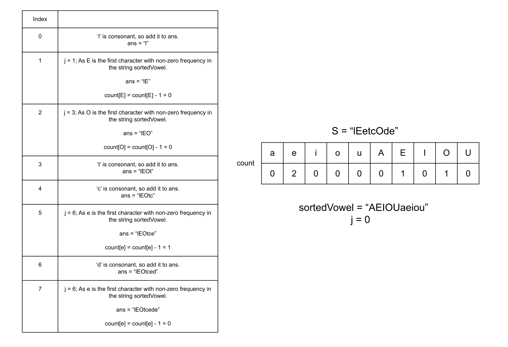

### Approach 1: Sorting

#### Intuition

Given a string `s` having English lowercase or uppercase letters, we need to build a new string such that the vowels in the original strings are arranged in the non-decreasing order of their ASCII values.

We don't want to break the original order of the consonants, so we will not sort the whole string. Instead, we need to sort only the vowels. Therefore, we will collect all the vowels from `s` into a string `temp`, and sort it in ascending order. Now, we need to put these characters back into the original string `s` in the sorted order, that is, the first vowel in the original string `s` will be replaced with the first character in `temp`, the second vowel will be replaced with the second character in `temp`, and so on. This way, the consonants will remain in the original order and the vowels will be sorted in the ascending order.

In some languages where strings are immutable, we can use other mutable data structures provided by that language to collect and sort all the vowel characters.

#### Algorithm

1. Create a method `isVowel` that returns `true` if the given character is a lowercase or uppercase vowel, and returns `false` otherwise.

2. Iterate over the string `s` and store the vowels in the string `temp`.

3. Sort the string `temp` in ascending order.

4. Initialize an empty string `ans` to store the answer string, and an integer `j` to `0` to track the current index in the string `temp`.

5. Iterate over the string `s` and for each character, if the character is a vowel, we add the character `temp[j]` to `ans` and increment `j`, otherwise, we add the character from `s`.

6. Return ans.

#### Complexity Analysis

Here, `N` is the number of characters in the string `s`.

-   Time complexity: $O(N \log N)$

    -   In the worst case, all characters in the string `s` could be vowels, and we will have to sort all the `N` characters which takes $O(N \log N)$ time. In the end, we will iterate over the string `s` and build the string `ans`, this will take $O(N)$ time. Therefore, the total time complexity is equal to $O(N \log N)$.

-   Space complexity: $O(N)$

    -   We need to store the vowels in the string `temp` which could be `N` in the worst case and thus will take $O(N)$ space. We also need space to store the answer string `ans`, however, the space to store the output is generally not considered as part of space complexity.

    -   Additional space is used for sorting the string `temp`. The space complexity of the sorting algorithm is language-specific. For instance, in Java, the Arrays.sort() for primitives is implemented as a variant of the quicksort algorithm whose space complexity is $O(\log N)$. In C++ sort() function provided by STL is a hybrid of Quick Sort, Heap Sort, and Insertion Sort and has a worst-case space complexity of $O(\log N)$. Thus, using the inbuilt sort() function might add up to $O(\log N)$ to space complexity.

### Approach 2: Counting Sort

#### Intuition

In the previous approach, we incurred an extra time complexity of $O(N \log N)$ due to sorting the string `temp`. The important point to observe here is that the string `temp` will only have ten different characters, as there are five vowels and their corresponding upper-case letters. In such scenarios, where the length is much greater than the number of distinct characters, it's much more efficient to use counting sort. This is because we will just have to count the frequencies for just ten characters instead of sorting all the characters in the string `temp`. We will store the frequencies of these vowels in a map `count`.

Since we know the ten characters we can have in the string `temp`, to get the ascending order of `temp` we can just iterate over the ten vowels in their ASCII order with their count. Hence, we will keep the string `sortedVowels` which will be equal to `AEIOUaeiou` which represents the ten vowels in ascending order of their ASCII values. Then similar to the previous approach, we will iterate over the string `s`, and for every vowel character, we will find the sorted vowel character we need to place here. For this, we will find the first character in `AEIOUaeiou` that has a remaining count in the map `count`, add this character to `s`, and decrement the `count` of this character.

#### Algorithm

1. Create a method `isVowel` that returns `true` if the given character is a lowercase or uppercase vowel or not, otherwise return `false`.

2. Iterate over the string `s` and store the frequencies of each vowel in the map `count`.

3. Initialize:

    - A string `sortedVowel` to `AEIOUaeiou`,

    - An empty string `ans` to store the answer string, and

    - An integer `j` to `0` to track the current index in the string `sortedVowel`.

4. Iterate over the string `s` and for each character

    - If the character is consonant, add it to the string `ans`.

    - If the character is a vowel, find the first character in the string `sortedVowel` which has a non-zero frequency in the map `count`.

    - Add the character `sortedVowel[j]` to `ans` and decrement the count in the map `count`.

5. Return `ans`.

#### Complexity Analysis

Here, `N` is the number of characters in the string s.

-   Time complexity: $O(N)$

    -   To store the frequencies in the map `count` we need $O(N)$ time. Then we iterate over each character in the string `s` to build the answer string `ans`, we first have to find the character in the string `sortedVowel`. This operation however will only take $O(1)$ time as there are only ten characters and we never iterate over the character twice. Hence, the total time complexity is equal to $O(N)$.

-   Space complexity: $O(1)$

-   The map `count` will only need $O(1)$ space as there are only ten vowels. The string `sortedVowels` also stores only ten characters and hence needs constant space. We also need space to store the answer string `ans`, however, the space to store the output is generally not considered as part of space complexity. Hence, the space complexity is constant.
