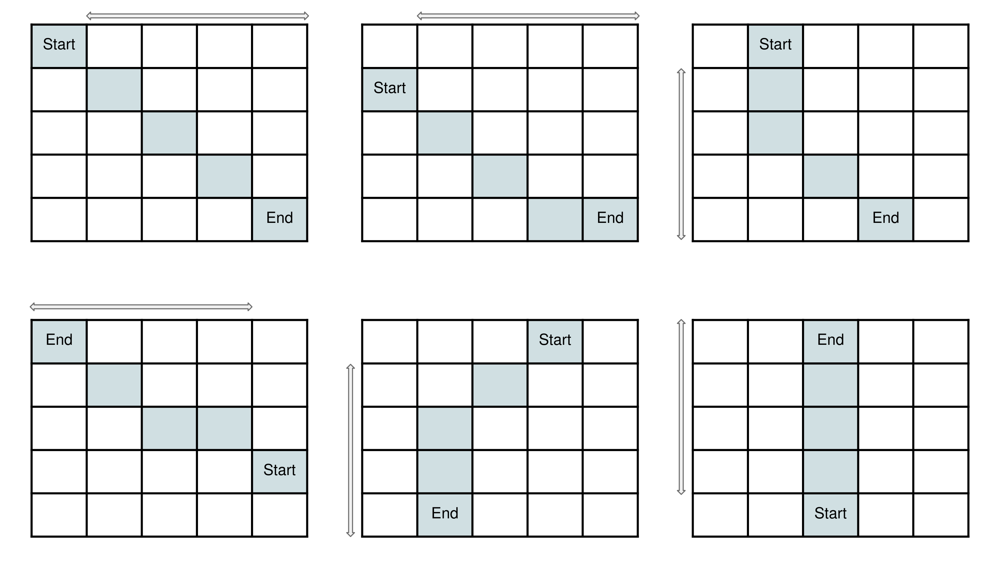

### Overview

Imagine navigating an infinite 2D grid, where you start at a point `(sx, sy)` and need to reach a different point `(fx, fy)` at exactly `t` seconds. Your movement involves transitioning to any of the 8 adjacent cells each second, and you're allowed to revisit the same cell during your journey. The challenge is to determine whether it's feasible to reach your destination at the specific time, considering these constraints.

### Approach: Math

#### Intuition

Let's first think about the minimum time required to move from the starting point to the destination.

As we can see from the graph, the minimum time to move from the starting point to the destination is `max(height, width)`, where `height` is the maximum absolute difference between the `x` coordinates, and `width` is the maximum absolute difference between the `y` coordinates of the start and end points. Since we are allowed to move through diagonally adjacent cells, let's assume the horizontal distance width is greater than the vertical distance height. When moving horizontally, we can choose to take exactly `height` diagonal steps within those `width` horizontal steps. This way, while covering `width` horizontal cells, we can also cover `height` vertical cells simultaneously.

For the purpose of this explanation let's define a variable `min_time` which denotes the minimum time to move from the starting point to the destination. Mathematically, as shown earlier `min_time = max(height, width)`. Let's define another variable `min_path` that denotes the path(s) we must follow to to reach the destination in `min_time`.

Now let's think about the relationship between `min_time` and `t`. As a reminder, `t` is the time we need to reach the destination.

There can be 3 cases:

1. `min_time > t`: In this case we will never be able to reach the destination.
2. `min_time = t`: In this case we will be able reach the destination by following the `min_path`.
3. `min_time < t`: Let's discuss this case with some examples.

Let's think through the cases where `min_time < t`. `t - min_time` can have the values in the range `[1, infinity)`.

-   If `t - min_time = 1`: We can move along the `min_path` and before reaching the destination move to a cell adjacent to the destination in order to spend 1 second of time. Then from this adjacent cell, we move to the destination. Hence, reaching the destination when `t - min_time = 1` is possible.

-   If `t - min_time = 2`: We can move along the `min_path` and before reaching the destination, we can move to any adjacent cell to spend 1 second of time, then move back to spend another 1 second of time. This way, we spend an additional 2 seconds and move to the destination to reach at the time t. Hence, reaching the destination when `t - min_time = 2` is possible.

For any other value of `t - min_time > 2`, we can always repeatedly move back and forth between two adjacent cells to consume these seconds (by 2 each time) until there are either 1 or 2 seconds remaining. This way, we can reduce the problem to the two cases we have already solved.

As we can see in the slides, whenever `t` is greater than the minimum time required to move from the starting point to the destination, we can successfully move from start to end. We can conclude that if `t` is greater than or equal to the minimum time required to move from the starting point to the destination, we can successfully move from start to end in given time `t`.

**Edge Case**: Let's think through the cases when `start` and `end` are the same cell.

If `start` and `end` are the same cell `min_time` will be 0. That is, you don't need to move anywhere to reach the destination.

-   If `t = 0`: Don't move anywhere, you are already at the destination hence reaching the destination in 0 seconds is possible.

-   If `t = 1`: You move to a cell adjacent to `start` and realize that you have already spent all the time you had. You can not move back to the `end` cell because that would increment the time by one and you will reach the destination in 2 seconds. Hence it is impossible to reach the destination when `start` and `end` refer to the same cell and `t = 1`.

-   If `t = 2`: You move to a cell adjacent to `start` and spend one second. Then you move back to the `end` cell, now you have spent a total of 2 seconds. Hence reaching the destination in 2 seconds is possible.

-   If `t = 3`: You move to a cell adjacent to `start` and spend one second. You again move to a cell adjacent to `start` to spend one second. Then you move back to the `end` cell, now you have spent a total of 3 seconds. Hence reaching the destination in 3 seconds is possible.

Similarly, for larger values of `t` we should be able to move to the destination when `start` and `end` refer to the same cell.

We can conclude that if `start` and `end` refer to the same cell we can successfully move from `start` to end in given time t if t != 1.

#### Algorithm

1. Calculate the width and height differences between the starting point `(sx, sy)` and the destination `(fx, fy)` using the abs function.

2. Check if both the width and height differences are equal to zero, which implies that the starting point is the same as the destination. Additionally, check if the target time `t` is equal to 1. If both conditions are met, return `False`.

3. Calculate the maximum of the width and height differences using the `max` function. This maximum represents the minimum time required to move from the starting point to the destination.

4. Compare the target time `t` with the maximum distance (either width or height). If the target time is greater than or equal to the maximum distance, return `True`. Otherwise, return `False`.

#### Complexity Analysis

-   Time complexity: $O(1)$. Since all the operations in the code take constant time and do not depend on the size of the grid or the input values, the overall time complexity of the code is $O(1)$, which is constant time complexity.

-   Space complexity: $O(1)$. This solution to this problem uses a fixed amount of additional space.
