### Overview

In this article, we will present many different approaches to solving this problem.

The level of these approaches varies greatly. Some approaches have different time complexities, while some simply present a different way of attacking the problem.

Note that not all of these approaches will be expected in an interview. At the start of each approach, there will be a comment regarding the difficulty of the approach and if it should be used in an interview.

For all approaches, we will assume that you are already familiar with how trees are given in LeetCode problems and how to traverse them.

### Approach 1: Count Frequency With Hash Map (DFS)

#### Intuition

> This is a great first approach to use in an interview. It is simple, easy to implement, has good complexity, and demonstrates an understanding of binary trees and hash maps. You should be prepared for follow-ups after implementing this solution.

Our goal is to find all the modes in the tree. A mode is a value that has the maximum frequency. Note that there could be multiple modes: for example, if we had the following tree:

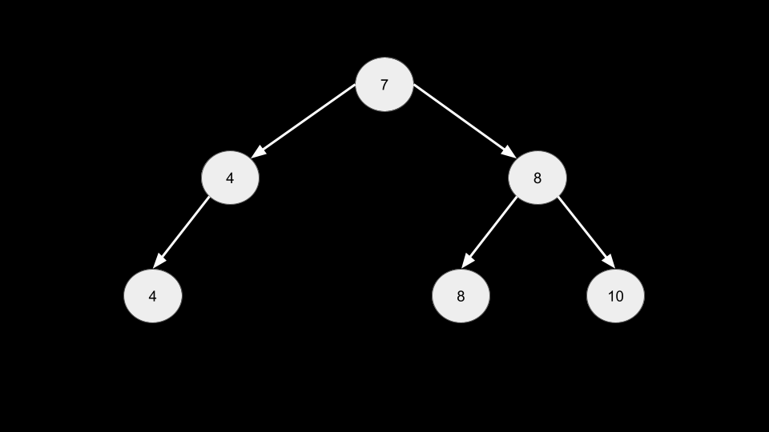

The frequency of each value is as follows:

| Value | Frequency |
| ----- | --------- |
| 4     | 2         |
| 7     | 1         |
| 8     | 2         |
| 10    | 1         |

The maximum frequency is 2, thus we have two modes: 4 and 8.

We can solve this problem by collecting the frequency of all values in the tree, finding the maximum frequency `maxFreq`, then checking which values have a frequency of `maxFreq`.

To count the frequency of each value, we will perform a depth-first search (DFS) on the tree to visit every node. We can initialize a hash map `counter` before starting the DFS. At each node we visit, we will update the frequency of `node.val` in` `counter``.

Once we have finished the DFS (visited every node), `counter` will hold the frequency of all values. We will save the maximum frequency as `maxFreq`, then iterate over all the elements of `counter` and check which ones have a frequency equal to `maxFreq`. Each of those elements will be in our final answer.

#### Algorithm

1. Initialize a hash map `counter`.

2. Create a function `dfs(node, counter)`:

- If `node` is null, immediately exit the function.

- Increment the frequency of `node.val` in` `counter``.

- Call `dfs` on both children with `dfs(`node.left`, counter)` and `dfs(`node.right`, counter)`.

3. Call `dfs(root, counter)`.

4. Find the maximum value in counter as `maxFreq`.

5. Initialize the answer list `ans`.

6. Iterate over all key-value pairs in `counter`. If the value is equal to `maxFreq`, add the key to `ans`.

7. Return `ans`.

#### Complexity Analysis

Given _n_ as the number of nodes in the tree,

- Time complexity: O(n)

  During the DFS, we visit each node once. At each node, we perform O(1) work since hash map operations cost O(1).

  Next, we find `maxFreq`, which involves iterating over `counter`. In the worst case scenario where the tree has only unique values, `counter` will have a size of _n_, and thus this will cost O(n).

  Finally, we construct `ans`, which involves iterating over `counter` again. Overall, our time complexity is O(n).

  In Java, we need to convert `ans` to the correct type, but this doesn't change the time complexity.

- Space complexity: O(n)

  During DFS, recursion is executed using the call stack. This call stack is equal to the depth of the tree, which in the worst case scenario is O(n). Also, as mentioned above, if the tree only has unique values `counter` will have a size of n. Thus, `counter` also uses O(n) space.

### Approach 2: Iterative DFS

#### Intuition

> This approach may be asked as a follow-up to the previous approach, or vice-versa if you implement this one first. It is common for interviewers to ask you to solve a problem with DFS both recursively and iteratively.

In this approach, we will use the same algorithm from the previous approach, except that we will implement the DFS iteratively.

Instead of using recursion, we will use a stack `stack`. Initially, we will have the `root` in the `stack`. Then, we will perform a DFS until the `stack` is empty using a while loop. At each iteration, we pop a `node` from the `stack`. We will increment the frequency of `node` in `counter` just like we did in the previous approach, then push the children of `node` to `stack` if they exist. In this way, we go as deep into the tree as possible before backtracking, similar to node exploration in recursive DFS.

Each iteration of the while loop is analogous to a function call from the previous approach, as we are handling a given `node`.

#### Algorithm

1. Initialize a hash map `counter` and a stack `stack` that contains `root`.

2. Perform a DFS. While `stack` is not empty:

- Pop `node` from the top of `stack`.

- Increment the frequency of `node.val` in` `counter``.

- If `node.left` is not null, push it to `stack`.

- If `node.right` is not null, push it to `stack`.

3. Find the maximum value in `counter` as `maxFreq`.

4. Initialize the answer list `ans`.

5. Iterate over all key-value pairs in `counter`. If the value is equal to `maxFreq`, add the key to `ans`.

6. Return `ans`.

#### Complexity Analysis

Given _n_ as the number of nodes in the tree,

- Time complexity: O(n)

  During the DFS, we visit each node once. At each node, we perform O(1) work since hash map and stack operations cost O(1).

  Next, we find `maxFreq`, which involves iterating over `counter`. In the worst case scenario where the tree has only unique values, `counter` will have a size of _n_, and thus this will cost O(n).

  Finally, we construct `ans`, which involves iterating over `counter` again. Overall, our time complexity is O(n).

  In Java, we need to convert `ans` to the correct type, but this doesn't change the time complexity.

### Approach 3: Breadth First Search (BFS)

#### Intuition

> Again, this approach may be asked as a follow-up if you implemented DFS first, or vice-versa. It is also common for interviewers to ask you to implement both DFS and BFS.
> We have included approaches 2 and 3 to demonstrate the usage of iterative DFS and BFS to solve this problem. We are able to do this because there isn't really a difference in using recursive DFS, iterative DFS, or BFS for this algorithm - we simply need to visit each node.

In this approach, we again use the same algorithm from the first two approaches. This time, we will perform the traversal using BFS.

With BFS, instead of using a stack (or the recursion stack) like in DFS, we use a queue. The main difference is that we handle nodes in a first-in, first-out fashion (FIFO) as opposed to in DFS where we handle nodes in a last-in, first-out (LIFO) fashion. This results in us visiting each node by depth - we can imagine the root at depth 0, the root's children at depth 1, the children of those children at depth 2, and so on.

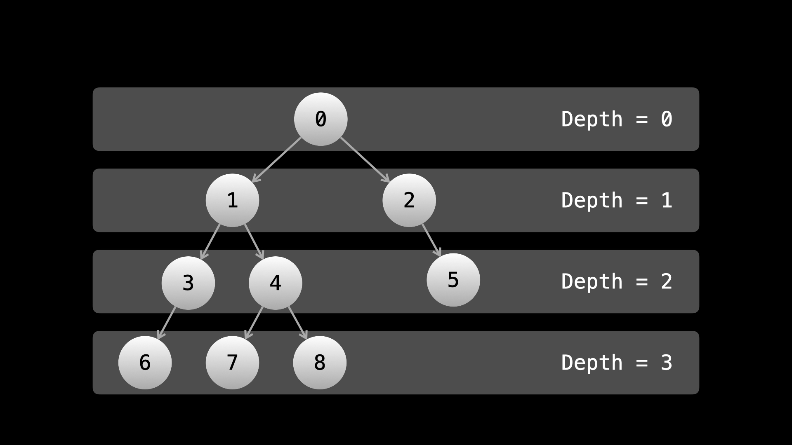

With BFS, we visit all nodes at a depth of `x` before visiting any node at a depth of `x + 1`. While BFS excels over DFS for many problems, in this problem it is just another way for us to perform the traversal. We simply need to visit each node in the tree so that we can record the frequencies in `counter`.

#### Algorithm

1. Initialize a hash map `counter` and a queue `queue` that contains `root`.

2. Perform a BFS. While `queue` is not empty:

- Pop `node` from the front of `queue`.

- Increment the frequency of `node.val` in `counter`.

- If `node.left` is not null, push it to `queue`.

- If `node.right` is not null, push it to `queue`.

3. Find the maximum value in `counter` as `maxFreq`.

4. Initialize the answer list `ans`.

5. Iterate over all key-value pairs in `counter`. If the value is equal to `maxFreq`, add the key to `ans`.

6. Return `ans`.

#### Complexity Analysis

Given _n_ as the number of nodes in the tree,

- Time complexity: O(n)

  During the BFS, we visit each node once. At each node, we perform O(1) work since hash map and queue operations cost O(1). Note that this assumes that the implementation of queue is efficient. In the code we presented above, all implementations are efficient.

  Next, we find `maxFreq`, which involves iterating over `counter`. In the worst case scenario where the tree has only unique values, `counter` will have a size of _n_, and thus this will cost O(n).

  Finally, we construct `ans`, which involves iterating over `counter` again. Overall, our time complexity is O(n).

- Space complexity: O(n)

  During DFS, `queue` may grow to a size of O(n). Also, as mentioned above, if the tree only has unique values then `counter` will have a size of `n`. Thus, counter also uses O(n) space.

### Approach 4: No Hash-Map

#### Intuition

> This approach is another way to attack the problem compared to the previous three approaches. It is slightly more complex and can be implemented if the interviewer asks for an alternate way to solve the problem. While this approach has the same time and space complexity as the first three, it runs slightly faster as we avoid the overhead associated with hash maps.

So far, we have not taken advantage of the fact that the input tree is a binary search tree (with duplicates). The first three approaches would work for any binary tree.

If you perform an inorder DFS traversal on a binary search tree (BST), you will handle the nodes in sorted order. Why?

Recall that in a BST, all nodes to the left are less than the current node and all nodes to the right are greater than the current node. In an inorder traversal, we handle all the nodes on the left first, then the current node, then all the nodes to the right.

The fact that there are duplicates in the BSTs given in this problem does not change this property - we will still handle nodes in sorted order during an inorder traversal. So how does this help us? If we can obtain the nodes in sorted order, then we can find the most frequent elements without needing a hash map.

Let's say we have a list `values` that has all the values in the tree in sorted order. Any duplicated values must be adjacent to each other in this list since it is sorted. We can iterate over this list from left to right and keep count of a streak - how many of the same number we have seen in a row. Let's call our current streak currStreak, and the number we have seen most recently currNum. For each num we iterate over:

- If `num = currNum`, then we can increment `currStreak` by `1`.

- If `num != currNum`, then we must start a new streak. We update `currNum = num` and reset `currStreak = 1`.

We will also maintain the `maxStreak` we have seen so far. When we find a new streak with a longer length, i.e. `currStreak > maxStreak`, we update `maxStreak` and reset the answer, since all the numbers stored in the answer are guaranteed not to be modes. When we find that `currStreak = maxStreak`, we can add the current `num` to the answer.

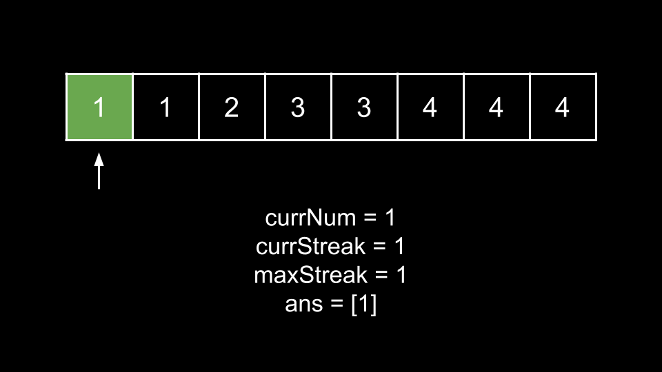
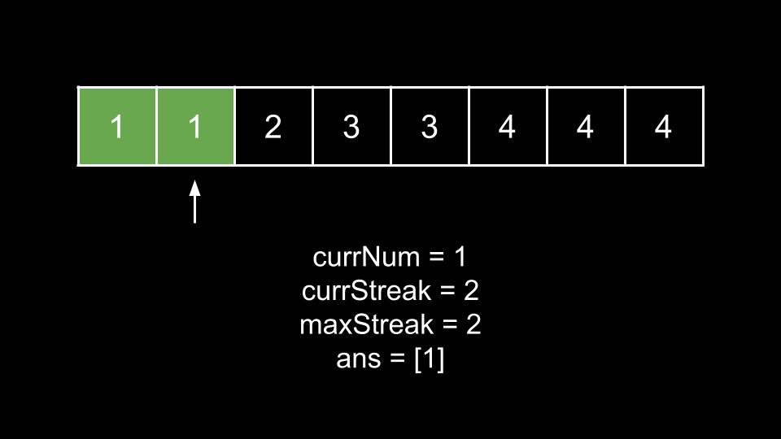
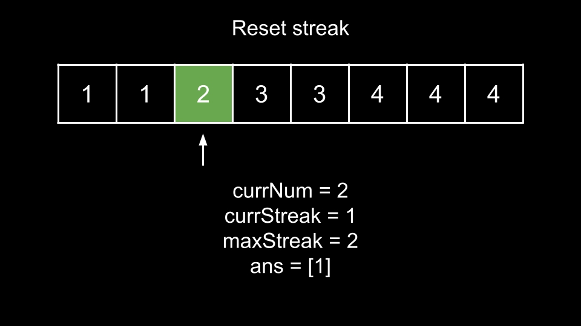
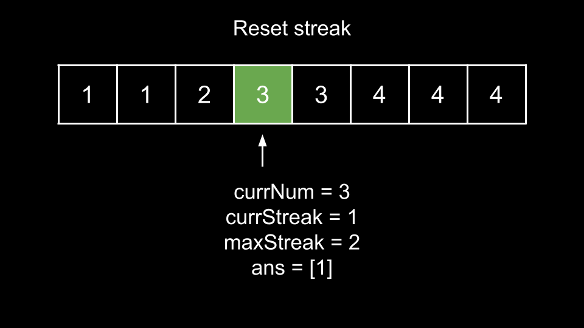
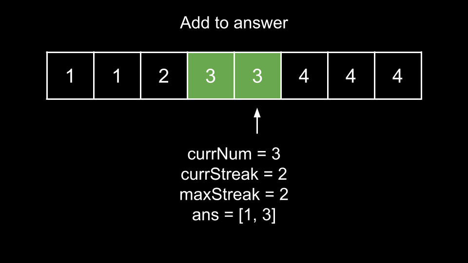
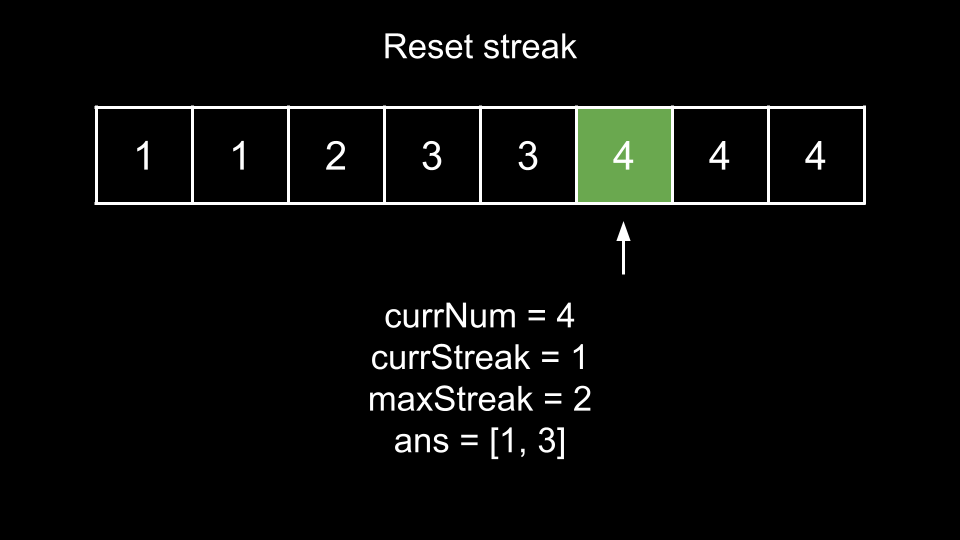
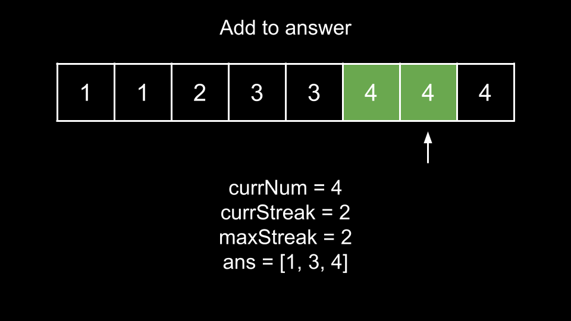
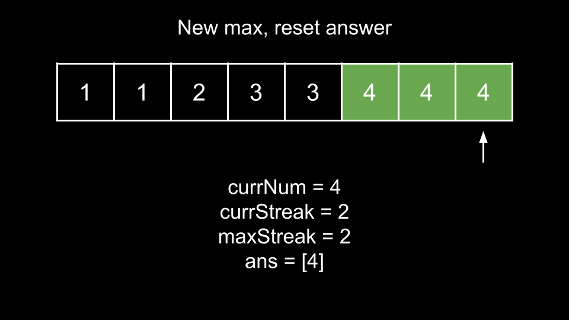

Once we have finished iterating through the array, `maxStreak` represents the max frequency and our answer list `ans` will hold all the values that have this frequency.

#### Algorithm

1. Perform an inorder DFS using a recursive `dfs` function to traverse the input tree. At each node, add `node.val` to a list `values`.

2. Initialize variables `maxStreak`, `currStreak`, `currNum` to `0` and an empty list `ans`.

3. Iterate over `values`. At each `num`:

- If `num = currNum`, increment `currStreak`. Otherwise, set `currStreak = 1`, `currNum = num`.

- If `currStreak > maxStreak`, update `maxStreak = currStreak` and reset `ans`.

- If `currStreak = maxStreak`, add `num` to `ans`.

4. Return `ans`.

#### Complexity Analysis

Given _n_ as the number of nodes in the tree,

- Time complexity: O(n)

  During the DFS, we visit each node once. At each node, we perform O(1) work.

  After the DFS, we iterate over `values` which has a length of _n_. At each iteration, we perform O(1) work. Overall, we perform O(n) work.

  You may notice that the runtime of this algorithm is faster than the first three approaches. This is because while hash map operations are O(1), the constant overhead still takes a little bit of time, especially compared to just using a list.

- Space complexity: O(n)

  During DFS, recursion is executed using the call stack. This call stack is equal to the depth of the tree, which in the worst case scenario is O(n). Also, the `values` array always grows to a size of `n`, and thus O(n) space.

### Approach 5: No "Values" Array

#### Intuition

> This approach could be asked as a follow-up to the previous approach. It also satisfies the follow-up given in the problem description (at the bottom, under the constraints). The only extra space we will use in this approach is the call stack from recursion.

In the previous approach, we perform an inorder traversal to create a `values` list. We then iterate over the `values` list. Do we need this extra list?

The answer is no: because by definition, the values we iterate over in `values` are the same values we visit during the inorder traversal, in the same order. Thus, we can perform the same logic on the fly during the inorder DFS, instead of performing DFS once to record the numbers in `values`, and then traversing `values` to count the recorded numbers.

We will use the same process: initialize `maxStreak`, `currStreak`, `currNum` as global variables. Perform an inorder traversal using recursion, and at each node, treat `num = node.val` and perform the same logic from the previous approach.

#### Algorithm

1. Initialize global variables `maxStreak`, `currStreak`, `currNum` to `0` and an empty list `ans`.

2. Perform an inorder traversal from `root`. At each node:

- If `node` is null, immediately exit the function.

- Call `dfs(node.left)`.

- Set `num = node.val`.

- If `num = currNum`, increment `currStreak`. Otherwise, set `currStreak = 1`, `currNum = num`.

- If `currStreak > maxStreak`, update `maxStreak = currStreak` and reset `ans`.

- If `currStreak = maxStreak`, add `num` to `ans`.

- Call `dfs(node.right)`.

3. Return `ans`.

#### Complexity Analysis

Given _n_ as the number of nodes in the tree,

- Time complexity: O(n)

  We perform a DFS, visiting each node in the tree once. At each node, we perform O(1) work.

- Space complexity: O(n)

  During DFS, recursion is executed using the call stack. This call stack is equal to the depth of the tree, which in the worst case scenario is O(n).

  Note that space used by the answer is not considered part of the space complexity. If we don't count the recursion call stack space either (as suggested in the problem description's follow-up), then this approach uses O(1) space as we only use a few extra variables like `maxStreak`, `currStreak`, `currNum`.

### Approach 6: True Constant Space: Morris Traversal

#### Intuition

> This approach is very advanced and would not be expected in an interview. We have included it for completeness.

We will contiunue using the same idea from the previous approach. Is there a way for us to perform the inorder traversal without using any space, including the recursion call stack?

Morris traversal is an advanced technique that allows us to traverse a binary tree with constant auxiliary space. In this approach, we will implement a variant of Morris traversal that will still allow us to achieve an O(1) space complexity. To understand Morris traversal, we must first understand why a stack is "necessary" during DFS.

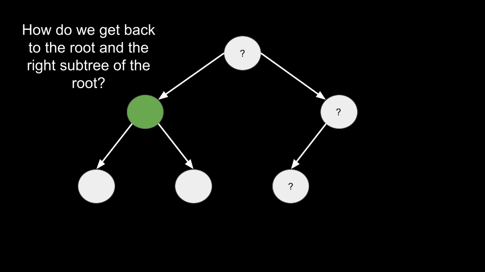

In the above tree, we start at the root and move to the left child. Once we are finished fully handling the left subtree, we then handle the root, and finally the right subtree. The reason we use extra stack space during DFS is to "remember" the root and right subtree. Think about it: if we move to `root.left`, how can we get back to `root` and thus `root.right`?

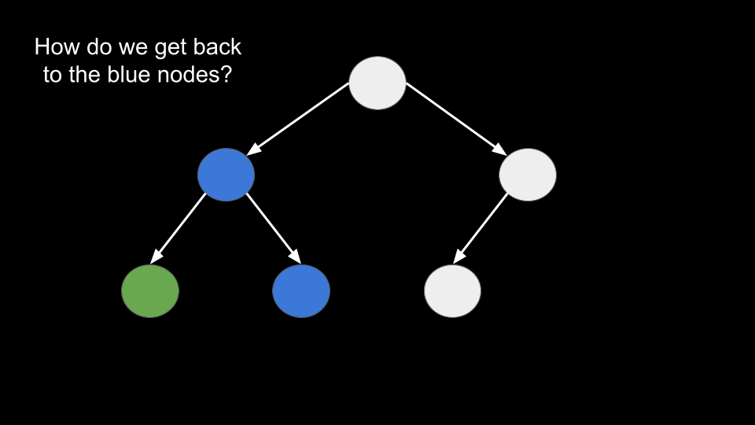

Furthermore, when we are the green node, how do we get back to the blue nodes? Let's assign each node a **friend**. A node's friend is the **rightmost** node in the left subtree. That is, to find the friend of `node`, we first do `node = node.left`, then do `node = node.right` until there is no right child.

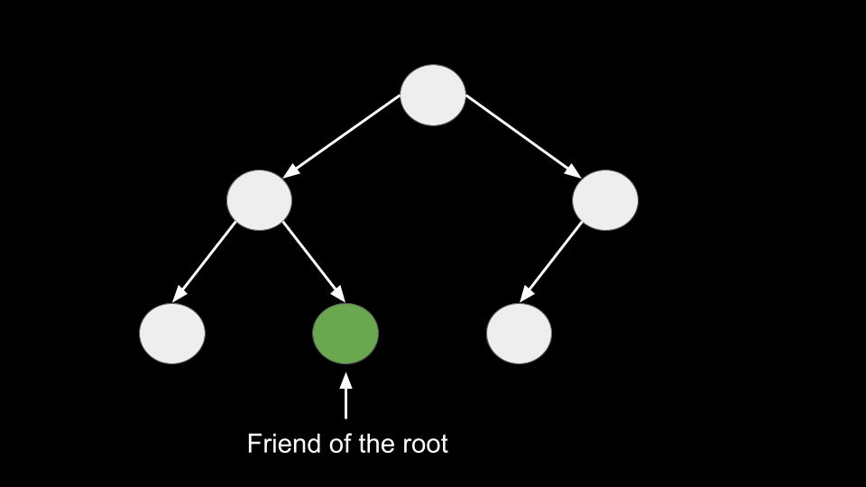

You may notice that some nodes will not have a friend. Namely, a node will not have a friend if it does not have a left child.

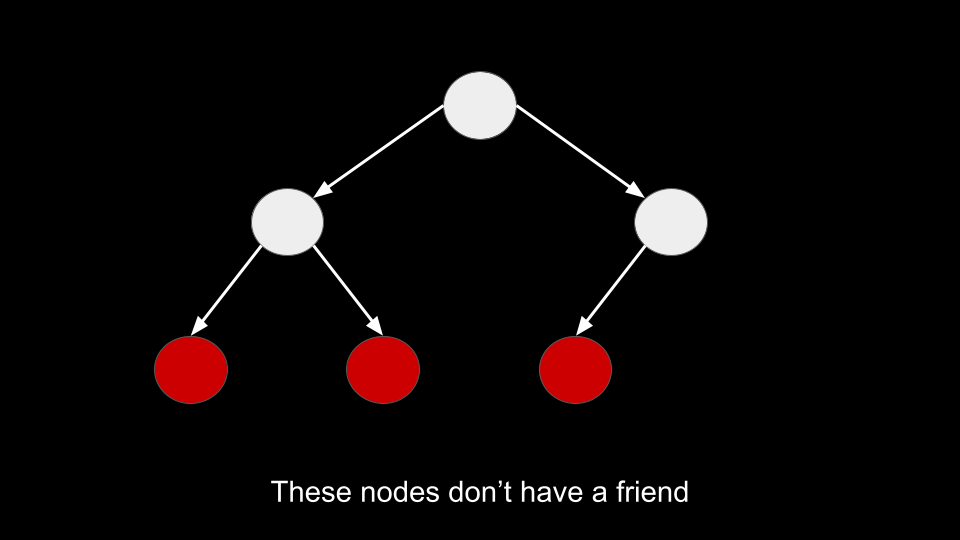

Morris traversal takes advantage of the following facts:

1. All friends are unique. That is, a node cannot be the friend of more than one node.

2. Friend nodes do not have right children. This is because by definition, we find friend nodes by traversing right until there is no right child.

Thus, we can safely assign the right child of each friend to the node it is friend to. In the following examples, we are numbering the nodes arbitrarily (these are not the values of a binary search tree):

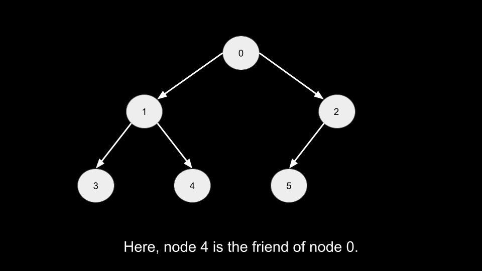

The rightmost node in the left subtree of the root is the node labelled `4`. Thus, we can assign the right child of `4` to the root.

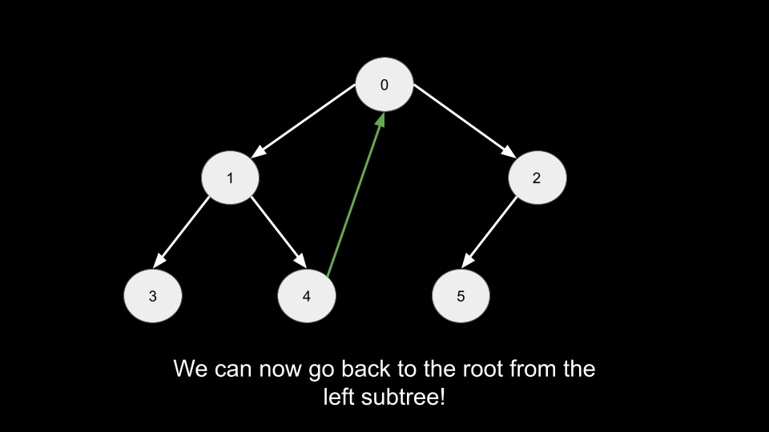

In these example images, green edges will indicate "friend" edges. Notice that now, we have a way back to the root (and thus the right subtree of the root) after entering the left subtree! Let's add the other friend edges.

With these friend edges, we can now perform an inorder traversal without recursion or a stack! We start by handling the `3`, then use the friend edge to get back to `1`. We handle the `1`, then the `4`, and then use the friend edge to get back to the `root`. After handling the `root`, we handle the `5`, then use the friend edge to get back to the `2`, which is the final node in our inorder traversal.

Now comes the tricky part: how do we implement this idea? We will use the following process. First, initialize `curr = root`. This represents the current node that we iterating on. Next, we perform the following in a while loop until `curr = null`, indicating we have finished the traversal:

- If `curr.left != null`, we will find the `friend` of `curr`. After finding `friend`, we set `friend.right = curr` then move to the left subtree with `curr = curr.left`. Once we are in the left subtree, we should delete the edge to prevent any infinite loops.

- If `curr.left = null`, it means there is no left subtree. We can handle this node now, then move to the right with `curr = curr.right`.

We will quickly demonstrate the traversal using the previous example. At any given time, the green node is `curr`.

Initially, `curr = root`. Because there is a left subtree, we will find the `friend`.

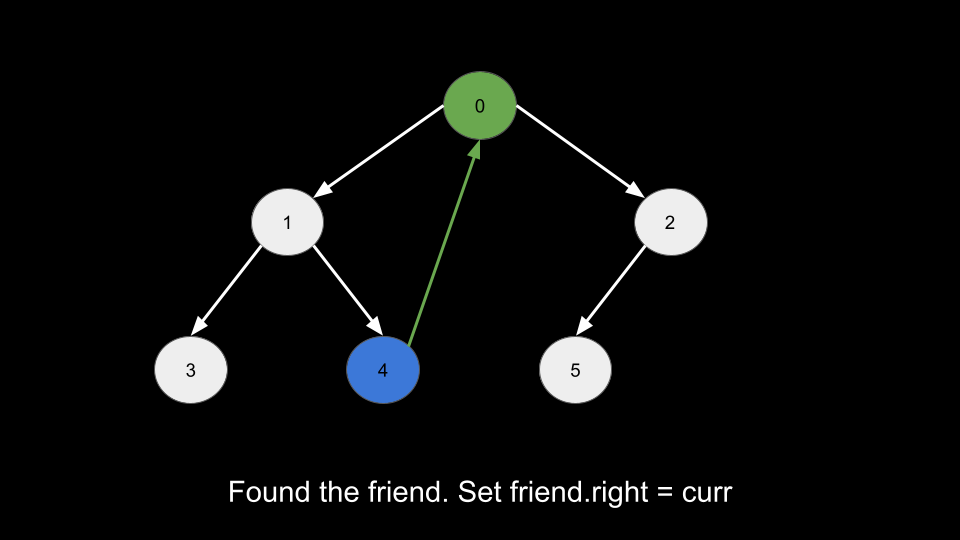

We find the `friend` by moving to the left subtree, then moving right as much as we can. Set `friend.right = curr`. Next, we set `curr = curr.left`.

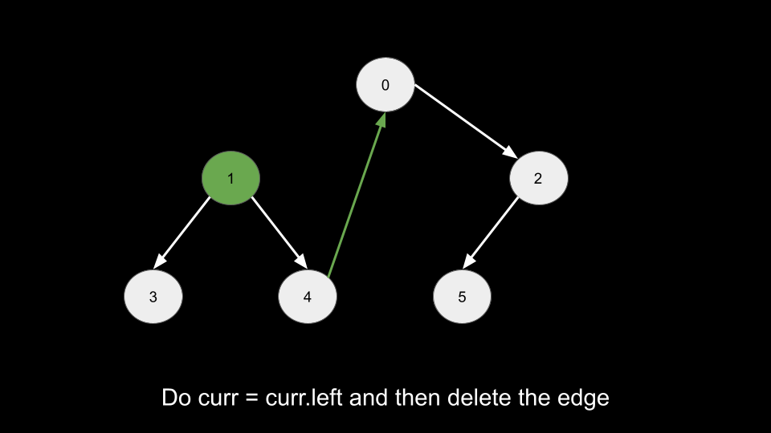

After we move to the left subtree, we must delete the edge we used. This is is so when we return back to the `root`, we don't repeat the process we just performed (as without deleting the edge, `root.left != null`).

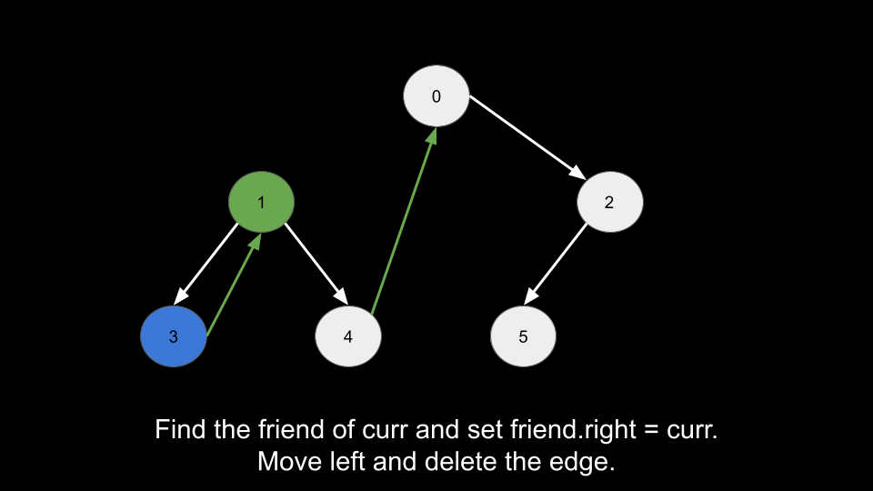

Again, `curr.left != null`, so we find the `friend` and set `friend.right = curr`. Then we move to the left subtree and delete the edge.

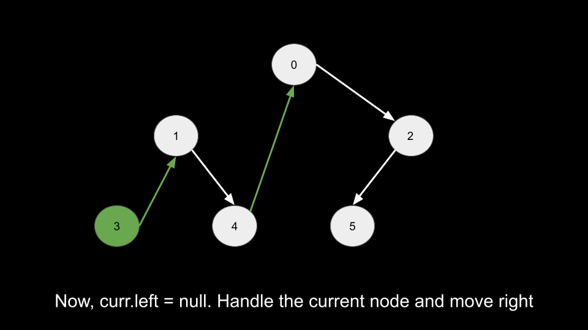

At the node labelled 3, we have no left subtree. Thus we can now handle this node and move to `curr.right`, which you will notice is the `friend` edge we created earlier.

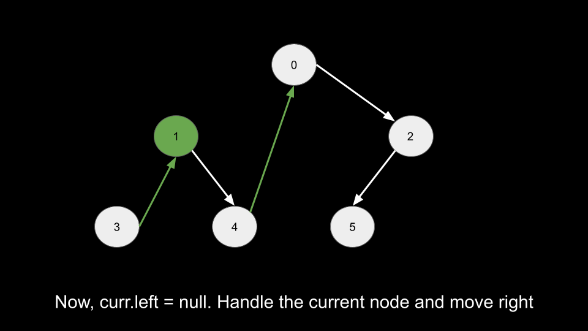

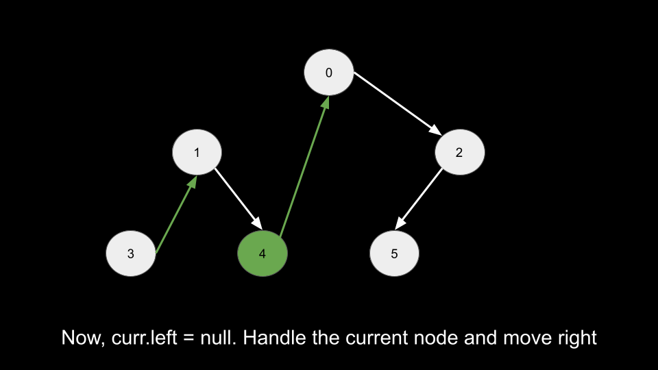

The next two nodes, `1` and `4` are handled the same way. Notice that so far, we have handled nodes in the order `3, 1, 4`, which is the correct order for an inorder traversal. Now, we find ourselves back at the `root`. Because we deleted the left edge earlier, we now move handle the `root` and move right.

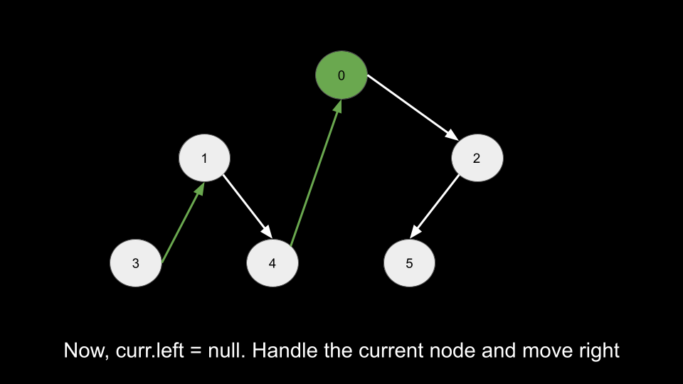

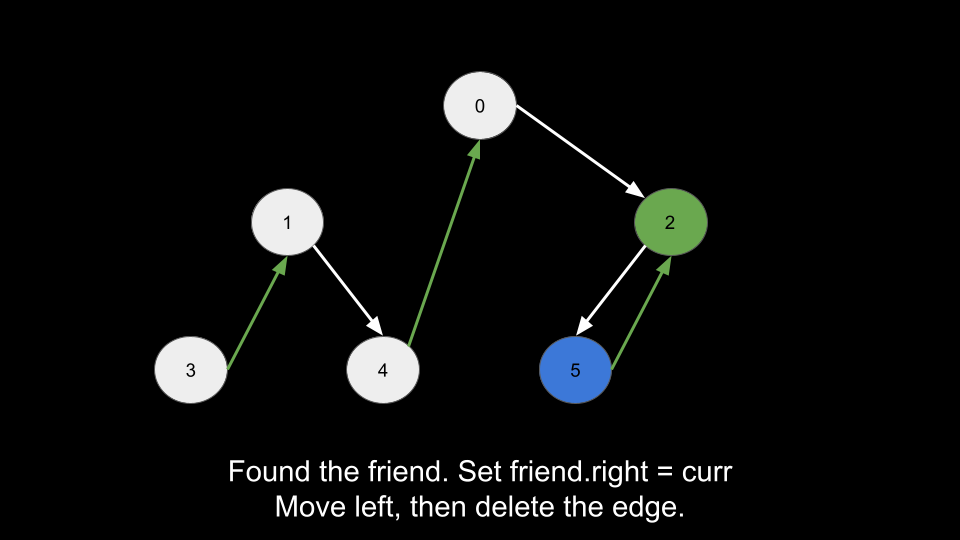

We have reached another node where `curr.left != null`. We find the `friend` and set the right edge.

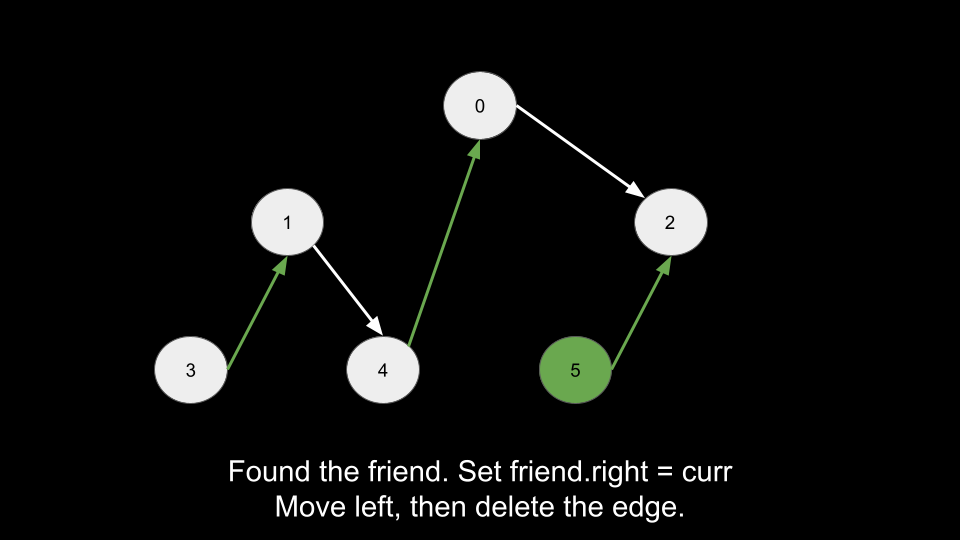

At the node labelled `5`, we find that `curr.left = null`. Thus, we handle the node and then move right (back to the `2`, as we set this "friend" edge earlier).

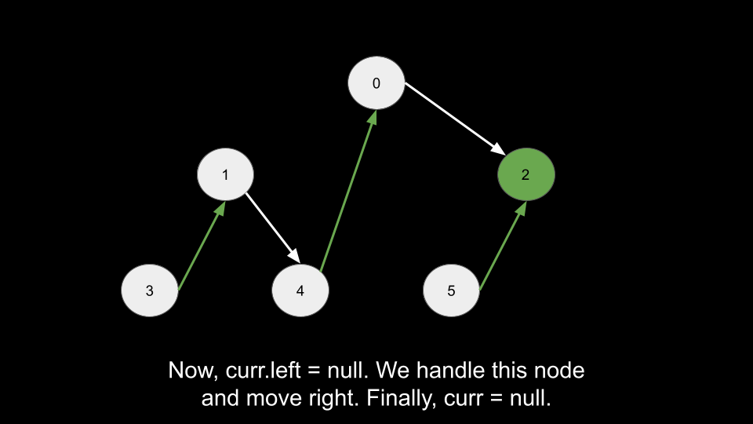

We finally handle the last node. The traversal ends as we move right, but there is no right child. We handled the nodes in the correct order: `3, 1, 4, 0, 5, 2`.

Finally, we solve the problem by using the same algorithm from the previous approach during our Morris traversal.

#### Algorithm

1. Initialize variables `maxStreak`, `currStreak`, `currNum` to `0` and an empty list `ans`. Also, initialize `curr = root`.

2. While `curr != null`, perform Morris traversal:

- `If curr.left != null`:

  - Find `friend`. We first set `friend = curr.left`, then move with `friend = friend.right` as long as `friend.right` exists.

  - Once `friend` is found, we set `friend.right = curr`.

  - Move to `curr.left` and delete the edge. You can do this by first saving `left = curr.left`, then setting `curr.left = null`, and finally performing `curr = left`.

- Otherwise, `curr.left = null`:

  - Set `num = curr.val`.

  - If `num = currNum`, increment `currStreak`. Otherwise, set `currStreak = 1`, `currNum = num`.

  - If `currStreak > maxStreak`, update `maxStreak = currStreak` and reset `ans`.

  - If `currStreak = maxStreak`, add `num` to `ans`.

  - Perform `curr = curr.right`.

3. Return `ans`.

#### Complexity Analysis

Given _n_ as the number of nodes in the tree,

- Time complexity: O(n)

  You may be thinking: there is a nested while loop, wouldn't this algorithm have a time complexity of O(n^2)? The answer is no, because the inner while loop can only iterate O(n) times total across the entîre algorithm.

  In a binary tree with _n_ nodes, there are `n-1` edges. This is because every node except for the root has a parent. During a Morris traversal, we never use an edge more than twice. We use each edge once to move `curr` through the tree, and we use each edge another time to find friends.

  This means we have O(2 \* (n - 1)) = O(n) edge iterations. Thus, the Morris traversal overall costs O(n), since everything else we do costs O(1).

- Space complexity: O(1)

  We don't count the answer as part of the space complexity. The only extra space we use are a few extra variables like maxStreak, currStreak, currNum. Thus, we have achieved a true O(1) space complexity.

  Note that we are modifying the input in this algorithm, which may be considered as a bad practice. Some people will also argue that by modifying the input, we should also include it in the space complexity.

#### Morris Traversal Follow-Up

As mentioned before, what we have implemented above is a variant of the traditional Morris traversal. One drawback to this variant is that the tree is heavily modified after the traversal. With some small changes, we can actually "repair" the tree to its original state while still accomplishing an O(1) space traversal!

This article focused on the variant for the sake of brevity. We encourage any eager readers to try and implement the standard traversal on their own as a follow-up.
