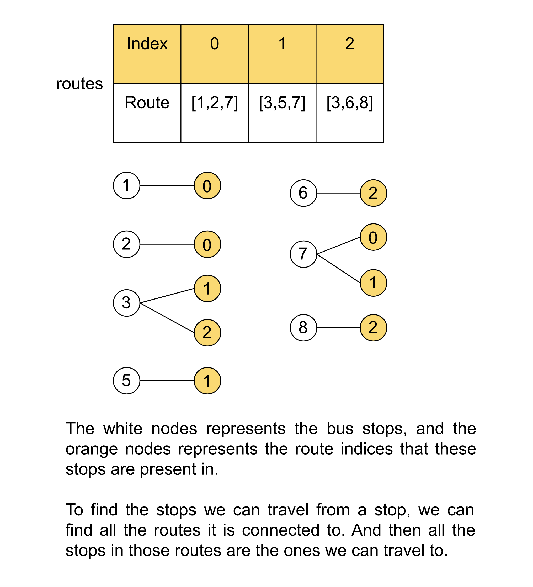
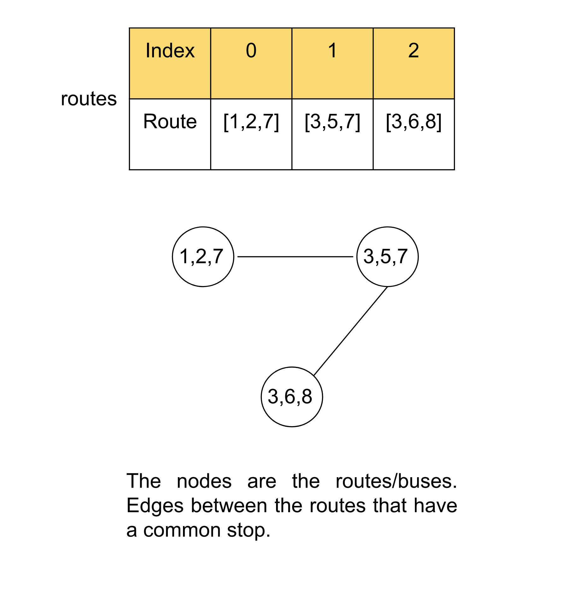

### Approach 1: Breadth-First Search (BFS) with Bus Stops as Nodes

#### Intuition

This approach will build up the graph using the bus stops as the nodes. To connect the edges in this graph, we need to find the stop we can go from a particular stop. There can be multiple routes that have this stop, we can go to any bus stop that is present in all these routes. One way is to store all these bus stops in the routes that have this stop, but this would take up too much memory. Instead, we can only store the indices of the routes that have the stop. The next reachable stop from this stop will be all the bus stops on all these routes.

So, we have prepared a graph where the nodes are bus stops and we can find the next stop we can travel to from each stop. We need to find the shortest distance between two given nodes "source" and "target". Since the edges are unweighted, BFS is more appropriate than Dijkstra's algorithm.

In the problem statement, it's given that we are not on any bus initially. Hence, to start from the bus stop `source` we can board any of the bus that has the `source` as one of the stops in its route. So the breadth-first search here needs to be a multi-source BFS starting with all the buses that have the `source` in stops. During the BFS, we will pop the first bus from the queue and iterate over the stops that this route involves. For each stop, we will check if this stop is equal to `target`, and then we can return the current count of buses `busCount`. If the stop is not equal to `target` then we will iterate over all the routes that have this stop and add them to the queue if the route is not visited before. Note that we are keeping track of visited routes instead of bus stops because when we visit a route we are essentially visiting all the stops in that route and hence keeping track of visited stops individually is not that efficient.

If we have completed the BFS and still haven't reached the `target`, it implies there is no way to reach that stop and hence we can return `-1`.

### Algorithm

1. Return `0` if the `source` and `target` are the same.

2. Initialize an empty map from an integer to a list of integers `adjList` to store the edges. The key is the bus stop and the value is the list of integers denoting the indices of routes that have this stop.

3. Initialize an empty queue `q` and an unordered set `vis` to keep track of visited routes.

4. Insert the initial routes into the queue `q` and mark them visited in `vis`.

5. Iterate over the queue while it's not empty and do the following:

    - Pop the route from the queue.

    - Iterate over the stops in the route.

    - If the stop is equal to target, return `busCount`.

    - Otherwise, iterate over the routes for this stop in the map `adjList`.

    - Add the unvisited routes to the queue and mark them visited.

6. Return `-1` after completing the BFS.

#### Complexity Analysis

Here, `M` is the size of routes, and `K` is the maximum size of `routes[i]`.

-   Time complexity: $O(M^2 \cdot K)$

    -   To store the routes for each stop we iterate over each route and for each route, we iterate over each stop, hence this step will take $O(M \cdot K)$ time. In the BFS, we iterate over each route in the queue. For each route we popped, we will iterate over its stop, and for each stop, we will iterate over the connected routes in the map `adjList`, hence the time required will be $O(M \cdot K \cdot M)$ or $O(M^2 \cdot K)$.

-   Space complexity: $O(M \cdot K)$

    -   The map `adjList` will store the routes for each stop. There can be $M \cdot K$ number of stops in routes in the worst case (each of the `M` routes can have `K` stops), possibly with duplicates. When represented using `adjList`, each of the mentioned stops appears exactly once. Therefore, `adjList` contains an equal number of stop-route element pairs.

### Approach 2: Breadth-First Search (BFS) with Routes as Nodes

#### Intuition

Instead of considering the individual stops as the nodes in the graph, what if we consider the bus routes as the nodes? If we consider the bus routes as the nodes, all stops that are there in the bus route will be considered in that node itself and hence the buses required to travel across them should be 0. Two bus routes will be considered connected if they have a common stop, this is because it would need two travels from a stop on one bus route to another stop on the other route.

Now, we have the graph ready with routes as the nodes and edges between them if there is a common stop between them. We need to find a way to get the shortest distance between source and target. We can use a similar BFS strategy to get the shortest distance. Similar to the previous approach, it would be a multi-source BFS, the initial points of our search would be the routes that have the source as one of the stops.

During the BFS we will pop the route from the queue, we will first check if this route has the stop target. If it does, we can return the `busCount`. Otherwise, we will iterate over the next route that we can travel to. For each adjacent route, we will add it to the queue if it's not visited yet. If we have completed the BFS and still haven't reached the target, it implies there is no way to reach that stop and hence we can return `-1`.

#### Algorithm

1. Define these methods:

    1. `createGraph`: Iterate over each pair of routes and add an edge between them in `adjList` if there is a common stop in them.

    2. `haveCommonNode`: Accept two routes and return `true` if there is a common stop, otherwise `false`.

    3. `addStartingNodes`: Add all the routes in the queue `q` that have the source as one of the stops in it.

    4. `isStopExist`: Returns `true` if a stop is present in the route, `false` otherwise.

2. Return `0`, if the `source` and `target` is the same.

3. Iterate over the routes and sort each `route[i]`, this will help in finding if these routes have a common stop or not.

4. Add the edges in the graph using the createGraph method.

5. Add the starting nodes in the queue using the `addStartingNodes` method.

6. Iterate over the routes in the queue and for each route do the following:

    1. Pop the route from the queue.

    2. If the `target` is present in the route, return `busCount`.

    3. Otherwise, iterate over the adjacent routes for this route `adjList`.

    4. Add the unvisited routes to the queue and mark them visited.

7. Return `-1` after completing the BFS.

#### Complexity Analysis

Here, `M` is the size of routes, and `K` is the maximum size of routes[i].

-   Time complexity: $O(M^2 \cdot K)$

    -   The `createGraph` method will iterate over every pair of `M` routes and for each iterate over the `K` stops to check if there is a common stop, this step will take $O(M^2 \cdot K)$. The `addStartingNodes` method will iterate over all the `M` routes and check if the route has source in it, this step will take $O(M \cdot K)$. In BFS, we iterate over each of the `M` routes, and for each route, we iterate over the adjacent route which could be `M` again, so the time it takes is $O(M^2)$. Thus, the time complexity is equal to $O(M^2 \cdot K)$.

-   Space complexity: $O(M^2)$

    -   The map `adjList` will store the routes for each route, thus the space it takes is $O(M^2)$. The queue `q` and the set `visited` store the routes and hence can take $O(M)$ space. Thus, the total time complexity is equal to $O(M^2)$.
